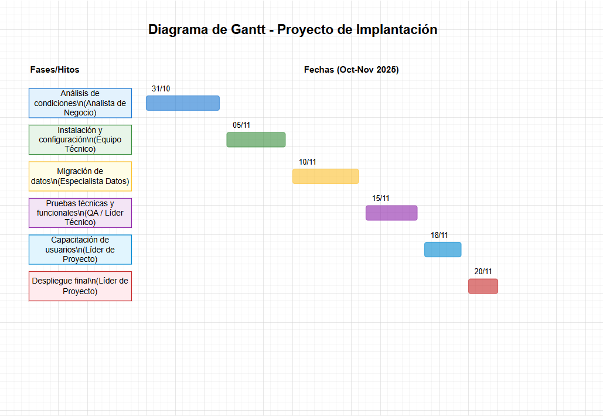

# Diagrama de Gantt

Adjunto el diagrama visual del cronograma del proyecto en formato draw.io. Puedes editarlo con Draw.io o diagrams.net.

## Diagrama de Gantt (Draw.io)

[Descargar archivo editable: diagrama-gantt.drawio](./diagrama-gantt.drawio)

## Sugerencia de estructura
- Fases del proyecto (análisis, instalación, migración, pruebas, capacitación, despliegue)
- Fechas de inicio y fin para cada fase
- Hitos principales
- Responsables

---

**Checklist para el diagrama de Gantt:**
- [x] Crear diagrama con todas las fases y hitos
- [x] Incluir fechas y responsables
- [x] Actualizar el diagrama según avances
- [x] Compartir el diagrama con el equipo
