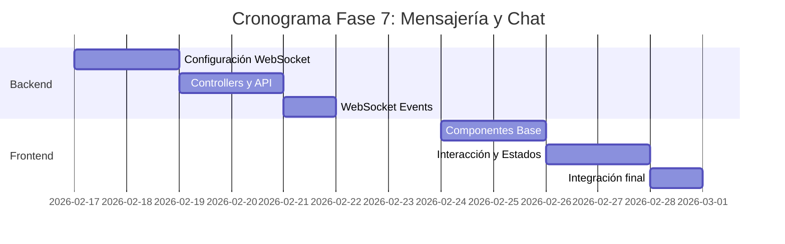

# 📱 Plan de Implementación - Fase 7: Mensajería y Chat

## 📋 Información General

| Campo | Valor |
|-------|-------|
| **Nombre** | Fase 7: Mensajería y Chat |
| **Duración** | 2 semanas |
| **Fecha Inicio** | 17 de febrero, 2026 |
| **Fecha Fin** | 28 de febrero, 2026 |
| **Responsable** | Equipo Desarrollo Frontend/Backend |
| **Prioridad** | Alta |

## 🎯 Objetivos

### Objetivo Principal
Implementar un sistema completo de mensajería en tiempo real entre usuarios de la plataforma InmoTech, permitiendo comunicación fluida entre compradores, vendedores y agentes inmobiliarios.

### Objetivos Específicos
- ✅ Configurar sistema de WebSockets para comunicación en tiempo real
- ✅ Implementar interfaz de chat intuitiva y responsive
- ✅ Desarrollar sistema de conversaciones organizadas
- ✅ Integrar notificaciones de mensajes
- ✅ Implementar historial de conversaciones
- ✅ Configurar estado de conexión y mensajes leídos/no leídos

## 🔧 Componentes a Implementar

### Backend Components

#### 1. Controllers
- **chatController.js**
  - `sendMessage()` - Enviar mensaje
  - `getConversation()` - Obtener conversación
  - `getConversations()` - Lista de conversaciones
  - `markAsRead()` - Marcar mensajes como leídos
  - `deleteMessage()` - Eliminar mensaje

- **messageController.js** 
  - `createMessage()` - Crear mensaje
  - `updateMessage()` - Actualizar mensaje
  - `getMessagesByConversation()` - Obtener mensajes
  - `searchMessages()` - Búsqueda en mensajes

#### 2. Models
```javascript
// Message Model
{
  id: String,
  conversationId: String,
  senderId: String,
  receiverId: String,
  content: String,
  messageType: String, // text, image, file, property_share
  timestamp: Date,
  isRead: Boolean,
  isDeleted: Boolean,
  propertyReference: String // Para compartir propiedades
}

// Conversation Model
{
  id: String,
  participants: [String], // Array de user IDs
  propertyId: String, // Propiedad relacionada (opcional)
  lastMessage: Object,
  lastActivity: Date,
  isActive: Boolean,
  unreadCount: Object // { userId: count }
}
```

#### 3. WebSocket Configuration
```javascript
// Socket events
- 'join-conversation'
- 'send-message'
- 'message-received'
- 'typing-start'
- 'typing-stop'
- 'user-online'
- 'user-offline'
```

### Frontend Components

#### 1. Main Chat Components
- **ChatPage.js** - Página principal del chat
- **ChatWindow.js** - Ventana de conversación activa
- **ConversationsList.js** - Lista de conversaciones
- **MessageBubble.js** - Componente individual de mensaje
- **MessageInput.js** - Input para enviar mensajes

#### 2. Supporting Components
- **ContactsList.js** - Lista de contactos disponibles
- **ChatHeader.js** - Header con info del contacto
- **OnlineStatus.js** - Indicador de estado en línea
- **TypingIndicator.js** - Indicador "escribiendo..."
- **MessageOptions.js** - Opciones de mensaje (eliminar, reenviar)

#### 3. Integration Components
- **PropertyShareModal.js** - Modal para compartir propiedades
- **ChatNotifications.js** - Notificaciones del chat
- **ChatSettings.js** - Configuración del chat

## 🚀 Actividades de Implementación

### Semana 1: Backend y WebSocket

#### Día 1-2: Configuración Base
- [ ] Instalar y configurar Socket.IO
- [ ] Crear modelos de Message y Conversation
- [ ] Configurar base de datos para chat
- [ ] Implementar autenticación de sockets

#### Día 3-4: Controllers y API
- [ ] Desarrollar chatController.js
- [ ] Desarrollar messageController.js
- [ ] Crear endpoints REST de respaldo
- [ ] Implementar validaciones de permisos

#### Día 5: WebSocket Events
- [ ] Configurar eventos de socket
- [ ] Implementar manejo de salas (conversaciones)
- [ ] Configurar estado de conexión
- [ ] Testing básico de WebSockets

### Semana 2: Frontend y UI

#### Día 1-2: Componentes Base
- [ ] Crear ChatPage.js layout
- [ ] Implementar ConversationsList.js
- [ ] Desarrollar ChatWindow.js
- [ ] Crear MessageBubble.js

#### Día 3-4: Interacción y Estados
- [ ] Implementar MessageInput.js
- [ ] Configurar socket client
- [ ] Manejar estados de conexión
- [ ] Implementar typing indicators

#### Día 5: Integración y Polish
- [ ] Integrar con notificaciones
- [ ] Implementar compartir propiedades
- [ ] Testing de UI/UX
- [ ] Optimización de rendimiento

## 📊 API Endpoints

### REST Endpoints (Respaldo)

```javascript
// Conversaciones
GET    /api/conversations                    // Lista de conversaciones del usuario
GET    /api/conversations/:id               // Conversación específica
POST   /api/conversations                   // Crear nueva conversación
PUT    /api/conversations/:id/read          // Marcar como leída
DELETE /api/conversations/:id               // Eliminar conversación

// Mensajes
GET    /api/conversations/:id/messages      // Mensajes de conversación
POST   /api/conversations/:id/messages      // Enviar mensaje
PUT    /api/messages/:id                    // Editar mensaje
DELETE /api/messages/:id                    // Eliminar mensaje
GET    /api/messages/search                 // Buscar mensajes

// Estado de usuario
GET    /api/chat/online-users               // Usuarios conectados
POST   /api/chat/typing                     // Notificar escribiendo
```

### WebSocket Events

```javascript
// Cliente → Servidor
socket.emit('join-conversation', { conversationId })
socket.emit('send-message', { conversationId, content, type })
socket.emit('typing-start', { conversationId })
socket.emit('typing-stop', { conversationId })

// Servidor → Cliente
socket.on('message-received', { message, conversation })
socket.on('user-typing', { userId, conversationId })
socket.on('user-online', { userId })
socket.on('conversation-updated', { conversation })
```

## ✅ Criterios de Aceptación

### Funcionales
- [ ] **Envío de mensajes en tiempo real** sin recargar página
- [ ] **Lista de conversaciones** ordenada por actividad reciente
- [ ] **Indicadores visuales** de mensajes leídos/no leídos
- [ ] **Estados de conexión** (en línea, desconectado, escribiendo)
- [ ] **Historial completo** de conversaciones persistente
- [ ] **Compartir propiedades** dentro del chat
- [ ] **Notificaciones** de nuevos mensajes
- [ ] **Búsqueda** en el historial de mensajes

### Técnicos
- [ ] **Rendimiento**: Carga de mensajes en <200ms
- [ ] **Escalabilidad**: Soporte para 100+ usuarios simultáneos
- [ ] **Persistencia**: Mensajes guardados en base de datos
- [ ] **Seguridad**: Validación de permisos de conversación
- [ ] **Responsive**: Interfaz funcional en móviles
- [ ] **Offline**: Mensajes enviados al reconectar

### UX/UI
- [ ] **Interfaz intuitiva** similar a apps populares
- [ ] **Animaciones fluidas** para nuevos mensajes
- [ ] **Indicadores claros** de estado de mensaje
- [ ] **Accesibilidad** con navegación por teclado
- [ ] **Temas consistentes** con diseño de la plataforma

## 🧪 Plan de Pruebas

### Pruebas Unitarias
```javascript
// Backend Tests
- chatController.test.js
- messageController.test.js
- socket-events.test.js
- conversation-model.test.js

// Frontend Tests
- ChatWindow.test.js
- MessageBubble.test.js
- socket-client.test.js
```

### Pruebas de Integración
- [ ] Flujo completo de envío/recepción
- [ ] Sincronización entre múltiples clientes
- [ ] Reconexión automática
- [ ] Notificaciones integradas

### Pruebas de Carga
- [ ] 50+ usuarios simultáneos por conversación
- [ ] 1000+ mensajes por conversación
- [ ] Tiempo de respuesta bajo carga
- [ ] Consumo de memoria del servidor

## 📚 Documentación a Entregar

### Técnica
1. **[Guía de Configuración WebSocket](./docs/websocket-setup.md)**
   - Instalación y configuración de Socket.IO
   - Variables de entorno necesarias
   - Configuración de CORS y autenticación

2. **[API Reference del Chat](./docs/chat-api.md)**
   - Documentación completa de endpoints
   - Eventos de WebSocket disponibles
   - Ejemplos de request/response

3. **[Arquitectura del Sistema de Chat](./docs/chat-architecture.md)**
   - Diagramas de flujo de mensajes
   - Estructura de base de datos
   - Patrones de diseño utilizados

### Usuario
4. **[Manual de Usuario - Chat](./docs/user-chat-guide.md)**
   - Cómo enviar y recibir mensajes
   - Funciones avanzadas del chat
   - Solución de problemas comunes

5. **[FAQ - Sistema de Mensajería](./docs/chat-faq.md)**
   - Preguntas frecuentes
   - Limitaciones del sistema
   - Buenas prácticas de uso

## 🔍 Métricas de Éxito

### Métricas Técnicas
- **Latencia de mensajes**: < 100ms
- **Tiempo de conexión**: < 3 segundos
- **Uptime del chat**: > 99.5%
- **Tasa de entrega**: > 99.9%

### Métricas de Negocio
- **Adopción del chat**: > 70% de usuarios activos
- **Mensajes por usuario/día**: > 5
- **Conversiones por chat**: Seguimiento de leads
- **Satisfacción del usuario**: > 4.5/5

## 🚨 Riesgos y Mitigación

### Riesgos Técnicos
| Riesgo | Impacto | Probabilidad | Mitigación |
|--------|---------|--------------|------------|
| Sobrecarga del servidor WebSocket | Alto | Media | Implementar rate limiting y balanceador |
| Pérdida de mensajes | Alto | Baja | Queue de mensajes y confirmaciones |
| Problemas de escalabilidad | Medio | Media | Arquitectura distribuida con Redis |

### Riesgos de Negocio
| Riesgo | Impacto | Probabilidad | Mitigación |
|--------|---------|--------------|------------|
| Baja adopción del chat | Medio | Baja | Integración con flujo principal |
| Spam o abuso | Alto | Media | Sistema de reportes y moderación |
| Problemas de privacidad | Alto | Baja | Cifrado y políticas claras |

## 📅 Cronograma Detallado



---

**Última actualización**: 12 de noviembre, 2025  
**Versión**: 1.0  
**Estado**: En desarrollo