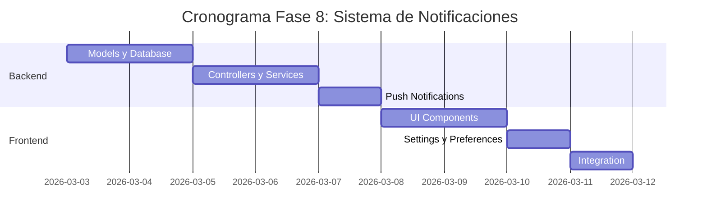

# 🔔 Plan de Implementación - Fase 8: Sistema de Notificaciones

## 📋 Información General

| Campo | Valor |
|-------|-------|
| **Nombre** | Fase 8: Sistema de Notificaciones |
| **Duración** | 1.5 semanas |
| **Fecha Inicio** | 3 de marzo, 2026 |
| **Fecha Fin** | 10 de marzo, 2026 |
| **Responsable** | Equipo Desarrollo Full-Stack |
| **Prioridad** | Alta |

## 🎯 Objetivos

### Objetivo Principal
Implementar un sistema completo de notificaciones que permita mantener a los usuarios informados sobre actividades relevantes en la plataforma InmoTech (mensajes, ofertas, actualizaciones de propiedades, etc.).

### Objetivos Específicos
- ✅ Desarrollar sistema de notificaciones en tiempo real
- ✅ Implementar diferentes tipos de notificaciones (push, email, in-app)
- ✅ Crear centro de notificaciones unificado
- ✅ Configurar preferencias personalizables de notificaciones
- ✅ Integrar con sistema de mensajería existente
- ✅ Implementar notificaciones por email automatizadas

## 🔧 Componentes a Implementar

### Backend Components

#### 1. Controllers
- **notificationController.js**
  - `createNotification()` - Crear nueva notificación
  - `getUserNotifications()` - Obtener notificaciones del usuario
  - `markAsRead()` - Marcar como leída
  - `markAllAsRead()` - Marcar todas como leídas
  - `deleteNotification()` - Eliminar notificación
  - `updatePreferences()` - Actualizar preferencias

#### 2. Services
- **notificationService.js**
  - `sendInAppNotification()` - Notificación in-app
  - `sendPushNotification()` - Push notification
  - `sendEmailNotification()` - Email notification
  - `scheduleNotification()` - Programar notificación
  - `processNotificationQueue()` - Procesar cola

- **emailService.js**
  - `sendWelcomeEmail()` - Email de bienvenida
  - `sendPropertyUpdateEmail()` - Actualización de propiedad
  - `sendOfferNotificationEmail()` - Notificación de oferta
  - `sendDigestEmail()` - Resumen diario/semanal

#### 3. Models
```javascript
// Notification Model
{
  id: String,
  userId: String,
  type: String, // message, offer, property_update, system, reminder
  title: String,
  message: String,
  data: Object, // Datos adicionales específicos del tipo
  isRead: Boolean,
  isPush: Boolean,
  isEmail: Boolean,
  priority: String, // low, medium, high, urgent
  createdAt: Date,
  readAt: Date,
  scheduledAt: Date,
  relatedEntity: {
    type: String, // property, offer, message, user
    id: String
  }
}

// NotificationPreferences Model
{
  userId: String,
  preferences: {
    inApp: {
      messages: Boolean,
      offers: Boolean,
      propertyUpdates: Boolean,
      systemAlerts: Boolean
    },
    push: {
      messages: Boolean,
      offers: Boolean,
      propertyUpdates: Boolean,
      systemAlerts: Boolean
    },
    email: {
      messages: Boolean,
      offers: Boolean,
      propertyUpdates: Boolean,
      systemAlerts: Boolean,
      digest: String // daily, weekly, never
    }
  }
}
```

### Frontend Components

#### 1. Notification Components
- **NotificationCenter.js** - Centro principal de notificaciones
- **NotificationToast.js** - Notificaciones toast/popup
- **NotificationBell.js** - Icono de campana con contador
- **NotificationList.js** - Lista de notificaciones
- **NotificationItem.js** - Item individual de notificación

#### 2. Settings Components
- **NotificationSettings.js** - Página de configuración
- **NotificationPreferences.js** - Preferencias por tipo
- **QuietHours.js** - Configuración de horarios silenciosos

#### 3. Integration Components
- **NotificationProvider.js** - Context provider
- **useNotifications.js** - Hook personalizado
- **NotificationSound.js** - Manejo de sonidos

## 🚀 Actividades de Implementación

### Semana 1: Backend y Core

#### Día 1-2: Models y Database
- [ ] Crear modelos de Notification y NotificationPreferences
- [ ] Configurar base de datos para notificaciones
- [ ] Implementar migración de datos
- [ ] Crear índices para optimización

#### Día 3-4: Controllers y Services
- [ ] Desarrollar notificationController.js
- [ ] Implementar notificationService.js
- [ ] Crear emailService.js
- [ ] Configurar cola de notificaciones (Redis/Queue)

#### Día 5: Push Notifications
- [ ] Integrar servicio push (Firebase/OneSignal)
- [ ] Configurar web push notifications
- [ ] Implementar registro de dispositivos
- [ ] Testing básico de push

### Semana 2: Frontend y Integration

#### Día 1-2: UI Components
- [ ] Crear NotificationCenter.js
- [ ] Implementar NotificationToast.js
- [ ] Desarrollar NotificationBell.js con contador
- [ ] Crear NotificationList.js

#### Día 3: Settings y Preferences
- [ ] Implementar NotificationSettings.js
- [ ] Crear configuración de preferencias
- [ ] Integrar quiet hours
- [ ] Testing de configuraciones

#### Día 4: Integration
- [ ] Integrar con sistema de chat
- [ ] Conectar con ofertas y propiedades
- [ ] Implementar notificaciones en tiempo real
- [ ] Testing completo del sistema

## 📊 API Endpoints

### Notification Management
```javascript
// Notificaciones
GET    /api/notifications                    // Lista de notificaciones del usuario
GET    /api/notifications/unread-count       // Contador de no leídas
POST   /api/notifications/mark-read/:id      // Marcar como leída
POST   /api/notifications/mark-all-read      // Marcar todas como leídas
DELETE /api/notifications/:id               // Eliminar notificación
POST   /api/notifications/clear-all          // Limpiar todas

// Preferencias
GET    /api/notifications/preferences        // Obtener preferencias
PUT    /api/notifications/preferences        // Actualizar preferencias
POST   /api/notifications/test               // Enviar notificación de prueba

// Push Notifications
POST   /api/notifications/register-device    // Registrar dispositivo
DELETE /api/notifications/unregister-device  // Desregistrar dispositivo
POST   /api/notifications/send-push          // Enviar push (admin)
```

### WebSocket Events
```javascript
// Cliente → Servidor
socket.emit('subscribe-notifications', { userId })
socket.emit('mark-notification-read', { notificationId })

// Servidor → Cliente
socket.on('new-notification', { notification })
socket.on('notification-read', { notificationId })
socket.on('notifications-cleared', { userId })
```

## ✅ Criterios de Aceptación

### Funcionales
- [ ] **Notificaciones in-app** aparecen en tiempo real
- [ ] **Centro de notificaciones** accesible y organizado
- [ ] **Push notifications** funcionan en navegadores compatibles
- [ ] **Email notifications** configurables por tipo
- [ ] **Preferencias granulares** por canal y tipo
- [ ] **Contador visual** de notificaciones no leídas
- [ ] **Historial completo** de notificaciones
- [ ] **Integración total** con chat, ofertas, propiedades

### Técnicos
- [ ] **Rendimiento**: Carga de notificaciones en <150ms
- [ ] **Escalabilidad**: Procesamiento de 1000+ notificaciones/min
- [ ] **Reliability**: 99.5% tasa de entrega
- [ ] **Batching**: Agrupación inteligente de notificaciones
- [ ] **Queue system**: Cola robusta para procesamiento
- [ ] **Fallback**: Degradación elegante si fallan servicios

### UX/UI
- [ ] **Interfaz intuitiva** para gestión de notificaciones
- [ ] **Toasts no intrusivos** con timer automático
- [ ] **Estados visuales claros** (leída/no leída)
- [ ] **Sonidos opcionales** para notificaciones
- [ ] **Responsive design** para todas las pantallas
- [ ] **Accesibilidad** con screen readers

## 🧪 Plan de Pruebas

### Pruebas Unitarias
```javascript
// Backend Tests
- notificationController.test.js
- notificationService.test.js
- emailService.test.js
- notification-model.test.js

// Frontend Tests
- NotificationCenter.test.js
- NotificationToast.test.js
- useNotifications.test.js
```

### Pruebas de Integración
- [ ] Flujo completo de creación y entrega
- [ ] Integración con chat y ofertas
- [ ] Push notifications en diferentes navegadores
- [ ] Email delivery y formato

### Pruebas de Carga
- [ ] 1000+ notificaciones simultáneas
- [ ] Performance del centro de notificaciones
- [ ] Stress test de la cola de procesamiento
- [ ] Latencia de notificaciones en tiempo real

## 📚 Documentación a Entregar

### Técnica
1. **[Guía de Configuración de Push](./docs/push-notifications-setup.md)**
   - Configuración de Firebase/OneSignal
   - Service Worker setup
   - Certificados y claves

2. **[API de Notificaciones](./docs/notifications-api.md)**
   - Endpoints disponibles
   - Tipos de notificaciones
   - Estructura de datos

3. **[Arquitectura del Sistema](./docs/notifications-architecture.md)**
   - Flujo de notificaciones
   - Queue processing
   - Integración con otros módulos

### Usuario
4. **[Guía de Usuario - Notificaciones](./docs/user-notifications-guide.md)**
   - Cómo configurar notificaciones
   - Tipos disponibles
   - Solución de problemas

5. **[Admin Guide - Gestión de Notificaciones](./docs/admin-notifications-guide.md)**
   - Panel de administración
   - Notificaciones masivas
   - Monitoreo del sistema

## 🔍 Métricas de Éxito

### Métricas Técnicas
- **Delivery rate**: > 99%
- **Latencia promedio**: < 200ms
- **Uptime del servicio**: > 99.9%
- **Queue processing**: < 1 segundo promedio

### Métricas de Engagement
- **Click-through rate**: > 15%
- **Opt-out rate**: < 5%
- **User engagement**: +20% actividad
- **Retention**: +10% usuarios que regresan

## 🚨 Riesgos y Mitigación

### Riesgos Técnicos
| Riesgo | Impacto | Probabilidad | Mitigación |
|--------|---------|--------------|------------|
| Spam de notificaciones | Alto | Media | Rate limiting y smart batching |
| Fallo del servicio push | Medio | Media | Fallback a notificaciones in-app |
| Sobrecarga de emails | Medio | Baja | Throttling y digest options |

### Riesgos de UX
| Riesgo | Impacto | Probabilidad | Mitigación |
|--------|---------|--------------|------------|
| Fatiga de notificaciones | Alto | Media | Smart filtering y configuración granular |
| Notificaciones irrelevantes | Medio | Media | Machine learning para relevancia |
| Problemas de privacy | Alto | Baja | Opt-in explícito y transparency |

## 📅 Cronograma Detallado



---

**Última actualización**: 12 de noviembre, 2025  
**Versión**: 1.0  
**Estado**: En desarrollo