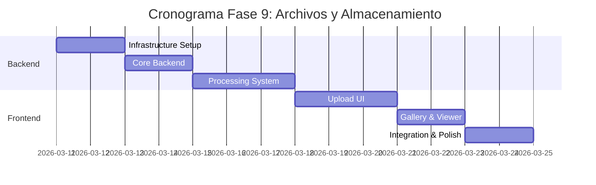

# 📁 Plan de Implementación - Fase 9: Archivos y Almacenamiento

## 📋 Información General

| Campo | Valor |
|-------|-------|
| **Nombre** | Fase 9: Archivos y Almacenamiento |
| **Duración** | 2 semanas |
| **Fecha Inicio** | 11 de marzo, 2026 |
| **Fecha Fin** | 25 de marzo, 2026 |
| **Responsable** | Equipo Desarrollo Full-Stack + DevOps |
| **Prioridad** | Alta |

## 🎯 Objetivos

### Objetivo Principal
Implementar un sistema robusto de gestión de archivos que permita subir, almacenar, procesar y servir archivos multimedia (imágenes, documentos, videos) de manera eficiente y segura en la plataforma InmoTech.

### Objetivos Específicos
- ✅ Configurar almacenamiento cloud escalable (AWS S3/Cloudinary)
- ✅ Implementar sistema de carga con validaciones
- ✅ Desarrollar procesamiento automático de imágenes
- ✅ Crear galería multimedia responsive
- ✅ Implementar compresión y optimización automática
- ✅ Configurar CDN para entrega rápida de archivos
- ✅ Establecer políticas de respaldo y versionado

## 🔧 Componentes a Implementar

### Backend Components

#### 1. Controllers
- **fileController.js**
  - `uploadFile()` - Subir archivo individual
  - `uploadMultiple()` - Subir múltiples archivos
  - `getFile()` - Obtener archivo por ID
  - `deleteFile()` - Eliminar archivo
  - `getFilesByEntity()` - Archivos de una entidad
  - `updateFileMetadata()` - Actualizar metadatos

#### 2. Services
- **uploadService.js**
  - `processUpload()` - Procesar upload
  - `validateFile()` - Validar archivo
  - `generateThumbnails()` - Generar miniaturas
  - `compressImage()` - Comprimir imágenes
  - `extractMetadata()` - Extraer metadatos

- **storageService.js**
  - `uploadToCloud()` - Subir a cloud storage
  - `deleteFromCloud()` - Eliminar de cloud
  - `generateSignedUrl()` - URLs firmadas
  - `syncWithCDN()` - Sincronizar con CDN

#### 3. Middleware
- **multerConfig.js** - Configuración de Multer
- **fileValidation.js** - Validaciones de archivos
- **imageProcessing.js** - Procesamiento de imágenes

#### 4. Models
```javascript
// File Model
{
  id: String,
  originalName: String,
  filename: String,
  mimeType: String,
  size: Number,
  path: String,
  cloudUrl: String,
  cdnUrl: String,
  thumbnails: {
    small: String,
    medium: String,
    large: String
  },
  metadata: {
    width: Number,
    height: Number,
    duration: Number, // Para videos
    location: Object, // EXIF GPS
    camera: String,
    takenAt: Date
  },
  entityType: String, // property, user, message
  entityId: String,
  uploadedBy: String,
  isPublic: Boolean,
  tags: [String],
  createdAt: Date,
  updatedAt: Date
}

// FileCategory Model
{
  id: String,
  name: String,
  allowedTypes: [String],
  maxSize: Number,
  requirements: {
    minWidth: Number,
    minHeight: Number,
    aspectRatio: String
  }
}
```

### Frontend Components

#### 1. Componentes de Carga
- **FileUploadModal.js** - Modal de subida de archivos
- **DragDropZone.js** - Zona de drag & drop
- **ProgressBar.js** - Barra de progreso de upload
- **FilePreview.js** - Vista previa de archivos

#### 2. Gallery Components
- **MediaGallery.js** - Galería principal
- **ImageViewer.js** - Visor de imágenes
- **VideoPlayer.js** - Reproductor de video
- **ThumbnailGrid.js** - Grid de miniaturas

#### 3. Management Components
- **FileManager.js** - Gestión de archivos
- **FileExplorer.js** - Explorador de archivos
- **BulkActions.js** - Acciones masivas
- **FilePermissions.js** - Permisos de archivos

#### 4. Integration Components
- **PropertyGallery.js** - Galería para propiedades
- **ProfileImageUpload.js** - Subida de avatar
- **MessageAttachments.js** - Adjuntos en mensajes
- **DocumentViewer.js** - Visor de documentos

## 🚀 Actividades de Implementación

### Semana 1: Backend y Storage

#### Día 1-2: Infrastructure Setup
- [ ] Configurar AWS S3 bucket
- [ ] Configurar Cloudinary account
- [ ] Implementar CDN setup (CloudFront)
- [ ] Crear modelos de File y FileCategory

#### Día 3-4: Core Backend
- [ ] Desarrollar fileController.js
- [ ] Implementar uploadService.js
- [ ] Crear storageService.js
- [ ] Configurar Multer middleware

#### Día 5-7: Processing & Optimization
- [ ] Implementar image processing (Sharp/ImageMagick)
- [ ] Crear sistema de thumbnails
- [ ] Configurar video processing (FFmpeg)
- [ ] Implementar compresión automática

### Semana 2: Frontend y Integration

#### Día 1-3: Interfaz de Carga
- [ ] Crear FileUploadModal.js
- [ ] Implementar DragDropZone.js
- [ ] Desarrollar ProgressBar.js
- [ ] Crear FilePreview.js

#### Día 4-5: Gallery & Viewer
- [ ] Implementar MediaGallery.js
- [ ] Crear ImageViewer.js
- [ ] Desarrollar VideoPlayer.js
- [ ] Implementar lazy loading

#### Día 6-7: Integration & Polish
- [ ] Integrar con PropertyGallery.js
- [ ] Conectar con MessageAttachments.js
- [ ] Implementar FileManager.js
- [ ] Testing completo y optimización

## 📊 API Endpoints

### File Management
```javascript
// Upload
POST   /api/files/upload                     // Subir archivo individual
POST   /api/files/upload-multiple            // Subir múltiples archivos
POST   /api/files/upload-url                 // Upload via URL

// Management
GET    /api/files                           // Listar archivos del usuario
GET    /api/files/:id                       // Obtener archivo específico
PUT    /api/files/:id                       // Actualizar metadatos
DELETE /api/files/:id                       // Eliminar archivo
POST   /api/files/bulk-delete               // Eliminar múltiples

// Entity Files
GET    /api/files/property/:id              // Archivos de propiedad
GET    /api/files/user/:id                  // Archivos de usuario
POST   /api/files/associate                 // Asociar archivo a entidad

// Processing
POST   /api/files/:id/process               // Procesar archivo
GET    /api/files/:id/thumbnails            // Obtener thumbnails
POST   /api/files/:id/regenerate-thumbs     // Regenerar miniaturas

// Security
POST   /api/files/:id/share                 // Compartir archivo
GET    /api/files/:id/signed-url            // URL firmada temporal
PUT    /api/files/:id/permissions           // Actualizar permisos
```

### File Categories
```javascript
GET    /api/file-categories                 // Categorías disponibles
POST   /api/file-categories                 // Crear categoría
PUT    /api/file-categories/:id             // Actualizar categoría
DELETE /api/file-categories/:id             // Eliminar categoría
```

## ✅ Criterios de Aceptación

### Funcionales
- [ ] **Upload múltiple** con drag & drop
- [ ] **Validación robusta** de tipos y tamaños
- [ ] **Generación automática** de thumbnails
- [ ] **Compresión inteligente** de imágenes
- [ ] **Galería responsive** con zoom
- [ ] **Reproductores integrados** para video/audio
- [ ] **Gestión de permisos** por archivo
- [ ] **Búsqueda y filtros** en archivos

### Técnicos
- [ ] **Performance**: Upload de 10MB en <30 segundos
- [ ] **Escalabilidad**: Soporte para 1TB+ de archivos
- [ ] **Redundancia**: Backup automático en múltiples regiones
- [ ] **CDN**: Entrega global con latencia <100ms
- [ ] **Compression**: Reducción 60-80% sin pérdida visual
- [ ] **Security**: URLs firmadas y control de acceso

### UX/UI
- [ ] **Interfaz intuitiva** para upload
- [ ] **Progress feedback** durante uploads
- [ ] **Preview inmediato** de archivos
- [ ] **Galería fluida** con navegación por teclado
- [ ] **Mobile optimization** para fotos
- [ ] **Error handling** con mensajes claros

## 🧪 Plan de Pruebas

### Pruebas Unitarias
```javascript
// Backend Tests
- fileController.test.js
- uploadService.test.js
- storageService.test.js
- file-model.test.js

// Frontend Tests
- FileUploadModal.test.js
- MediaGallery.test.js
- DragDropZone.test.js
```

### Pruebas de Integración
- [ ] Upload completo con procesamiento
- [ ] Integración con cloud storage
- [ ] CDN delivery y caching
- [ ] Permissions y security

### Pruebas de Performance
- [ ] Upload concurrente de múltiples usuarios
- [ ] Procesamiento de imágenes grandes
- [ ] Carga de galería con 100+ imágenes
- [ ] Stress test de bandwidth

## 📚 Documentación a Entregar

### Técnica
1. **[Guía de Configuración de Storage](./docs/storage-setup.md)**
   - AWS S3 configuration
   - CDN setup y optimización
   - Variables de entorno

2. **[API de Gestión de Archivos](./docs/files-api.md)**
   - Endpoints disponibles
   - Formatos soportados
   - Limits y restrictions

3. **[Arquitectura de Archivos](./docs/files-architecture.md)**
   - Flujo de upload y procesamiento
   - Storage strategy
   - Security model

### Usuario
4. **[Guía de Usuario - Archivos](./docs/user-files-guide.md)**
   - Cómo subir archivos
   - Tipos de archivo soportados
   - Mejores prácticas

5. **[Admin Guide - Gestión de Storage](./docs/admin-storage-guide.md)**
   - Monitoreo de usage
   - Configuración de límites
   - Limpieza de archivos huérfanos

## 🔍 Métricas de Éxito

### Métricas Técnicas
- **Upload success rate**: > 99.5%
- **Processing time**: < 30 segundos para 10MB
- **CDN hit ratio**: > 95%
- **Storage cost efficiency**: < $0.05/GB/mes

### Métricas de Usuario
- **File engagement**: > 80% de archivos visualizados
- **Upload adoption**: > 90% de usuarios activos
- **Performance satisfaction**: > 4.5/5
- **Error rate**: < 1% uploads fallidos

## 🚨 Riesgos y Mitigación

### Riesgos Técnicos
| Riesgo | Impacto | Probabilidad | Mitigación |
|--------|---------|--------------|------------|
| Storage costs escalation | Alto | Media | Monitoring + lifecycle policies |
| Upload failures | Medio | Media | Retry logic + multiple providers |
| CDN performance issues | Medio | Baja | Multiple CDN providers |

### Riesgos de Seguridad
| Riesgo | Impacto | Probabilidad | Mitigación |
|--------|---------|--------------|------------|
| Malware uploads | Alto | Media | Virus scanning + file validation |
| Unauthorized access | Alto | Baja | Signed URLs + permissions |
| DMCA violations | Medio | Media | Content moderation + reporting |

## 📅 Cronograma Detallado



## 💾 Storage Configuration

### AWS S3 Buckets Structure
```
inmotech-files-prod/
├── properties/
│   ├── images/
│   ├── documents/
│   └── videos/
├── users/
│   ├── avatars/
│   └── documents/
├── messages/
│   └── attachments/
└── temp/
    └── uploads/
```

### File Processing Pipeline
```javascript
// Image Processing
1. Upload → 2. Virus Scan → 3. Validation → 
4. Resize → 5. Compress → 6. Generate Thumbnails → 
7. Upload to CDN → 8. Save Metadata

// Video Processing  
1. Upload → 2. Validation → 3. Transcode → 
4. Generate Preview → 5. Upload to CDN → 6. Save Metadata
```

---

**Última actualización**: 12 de noviembre, 2025  
**Versión**: 1.0  
**Estado**: En desarrollo