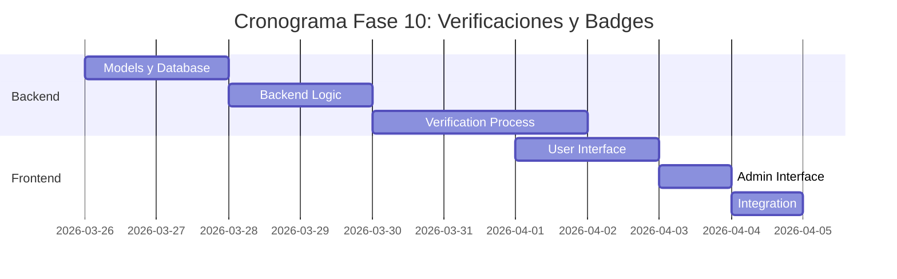

# ✅ Plan de Implementación - Fase 10: Verificaciones y Badges

## 📋 Información General

| Campo | Valor |
|-------|-------|
| **Nombre** | Fase 10: Verificaciones y Badges |
| **Duración** | 1.5 semanas |
| **Fecha Inicio** | 26 de marzo, 2026 |
| **Fecha Fin** | 2 de abril, 2026 |
| **Responsable** | Equipo Desarrollo Full-Stack |
| **Prioridad** | Media-Alta |

## 🎯 Objetivos

### Objetivo Principal
Implementar un sistema integral de verificaciones y badges que genere confianza entre usuarios, validando identidades, propiedades y estableciendo reputación dentro de la plataforma InmoTech.

### Objetivos Específicos
- ✅ Desarrollar sistema de verificación de identidad de usuarios
- ✅ Implementar verificación de propiedades y documentos
- ✅ Crear sistema de badges y logros
- ✅ Establecer niveles de confianza (trust scores)
- ✅ Integrar verificaciones con perfiles y listados
- ✅ Implementar proceso de apelaciones y revisiones

## 🔧 Componentes a Implementar

### Backend Components

#### 1. Controllers
- **verificationController.js**
  - `requestVerification()` - Solicitar verificación
  - `submitDocuments()` - Enviar documentos
  - `reviewVerification()` - Revisar solicitud (admin)
  - `approveVerification()` - Aprobar verificación
  - `rejectVerification()` - Rechazar verificación
  - `getVerificationStatus()` - Estado de verificación

#### 2. Services
- **verificationService.js**
  - `processIdVerification()` - Procesar ID verification
  - `validateDocuments()` - Validar documentos
  - `calculateTrustScore()` - Calcular score de confianza
  - `assignBadges()` - Asignar badges
  - `notifyVerificationStatus()` - Notificar estado

- **badgeService.js**
  - `createBadge()` - Crear badge
  - `awardBadge()` - Otorgar badge
  - `revokeBadge()` - Revocar badge
  - `getBadgesByUser()` - Badges del usuario
  - `updateBadgeProgress()` - Actualizar progreso

#### 3. Models
```javascript
// Verification Model
{
  id: String,
  userId: String,
  type: String, // identity, property, agent, business
  status: String, // pending, under_review, approved, rejected
  documents: [{
    type: String, // id_front, id_back, proof_address, property_deed
    fileId: String,
    status: String,
    reviewNotes: String
  }],
  submittedAt: Date,
  reviewedAt: Date,
  reviewedBy: String,
  approvedAt: Date,
  expiresAt: Date,
  verificationData: {
    name: String,
    documentNumber: String,
    address: Object,
    phoneNumber: String,
    email: String
  },
  reviewNotes: String,
  appealCount: Number
}

// Badge Model
{
  id: String,
  name: String,
  description: String,
  category: String, // verification, achievement, milestone
  icon: String,
  color: String,
  criteria: {
    type: String,
    requirements: Object
  },
  isActive: Boolean,
  rarity: String, // common, rare, epic, legendary
  points: Number
}

// UserBadge Model
{
  id: String,
  userId: String,
  badgeId: String,
  awardedAt: Date,
  awardedBy: String,
  progress: Number,
  isVisible: Boolean,
  notes: String
}

// TrustScore Model
{
  userId: String,
  score: Number, // 0-100
  factors: {
    identityVerified: Number,
    propertyOwnershipVerified: Number,
    completedTransactions: Number,
    positiveReviews: Number,
    timeSinceRegistration: Number,
    socialVerification: Number
  },
  lastCalculated: Date,
  history: [{
    score: Number,
    date: Date,
    reason: String
  }]
}
```

### Frontend Components

#### 1. Verification Components
- **UserVerificationPage.js** - Página de verificación principal
- **VerificationWizard.js** - Wizard paso a paso
- **DocumentUpload.js** - Subida de documentos
- **VerificationStatus.js** - Estado de verificación
- **VerificationBadges.js** - Mostrar badges obtenidos

#### 2. Admin Components
- **VerificationDashboard.js** - Dashboard administrativo
- **DocumentReviewer.js** - Revisor de documentos
- **VerificationQueue.js** - Cola de verificaciones
- **BadgeManager.js** - Gestión de badges

#### 3. Display Components
- **TrustScoreIndicator.js** - Indicador de score
- **BadgeDisplay.js** - Mostrar badges
- **VerificationCheckmark.js** - Checkmark de verificado
- **ProfileVerifications.js** - Verificaciones en perfil

## 🚀 Actividades de Implementación

### Semana 1: Core System

#### Día 1-2: Models y Database
- [ ] Crear modelos de Verification, Badge, UserBadge, TrustScore
- [ ] Configurar base de datos y relaciones
- [ ] Implementar migración de datos
- [ ] Crear índices para consultas

#### Día 3-4: Backend Logic
- [ ] Desarrollar verificationController.js
- [ ] Implementar verificationService.js
- [ ] Crear badgeService.js
- [ ] Implementar cálculo de trust score

#### Día 5-7: Verification Process
- [ ] Configurar document validation
- [ ] Implementar review workflow
- [ ] Crear sistema de notificaciones
- [ ] Testing de procesos

### Semana 2: Frontend y Integration

#### Día 1-2: User Interface
- [ ] Crear UserVerificationPage.js
- [ ] Implementar VerificationWizard.js
- [ ] Desarrollar DocumentUpload.js
- [ ] Crear VerificationStatus.js

#### Día 3: Admin Interface
- [ ] Implementar VerificationDashboard.js
- [ ] Crear DocumentReviewer.js
- [ ] Desarrollar VerificationQueue.js
- [ ] Testing de admin panel

#### Día 4: Integration
- [ ] Integrar con perfiles de usuario
- [ ] Conectar con listados de propiedades
- [ ] Implementar badges en UI
- [ ] Testing completo del flujo

## 📊 API Endpoints

### User Verification
```javascript
// Verification Requests
POST   /api/verifications                    // Iniciar proceso de verificación
GET    /api/verifications/user              // Verificaciones del usuario
PUT    /api/verifications/:id               // Actualizar verificación
DELETE /api/verifications/:id               // Cancelar verificación

// Documents
POST   /api/verifications/:id/documents     // Subir documentos
PUT    /api/verifications/:id/documents/:docId // Actualizar documento
DELETE /api/verifications/:id/documents/:docId // Eliminar documento

// Status
GET    /api/verifications/:id/status        // Estado de verificación
POST   /api/verifications/:id/appeal        // Apelar rechazo
```

### Admin Verification
```javascript
// Review Process
GET    /api/admin/verifications/pending     // Verificaciones pendientes
PUT    /api/admin/verifications/:id/review  // Revisar verificación
POST   /api/admin/verifications/:id/approve // Aprobar verificación
POST   /api/admin/verifications/:id/reject  // Rechazar verificación

// Analytics
GET    /api/admin/verifications/stats       // Estadísticas
GET    /api/admin/verifications/reports     // Reportes
```

### Badges System
```javascript
// User Badges
GET    /api/badges/user                     // Badges del usuario
GET    /api/badges/available                // Badges disponibles
PUT    /api/badges/:id/visibility           // Cambiar visibilidad

// Badge Management
POST   /api/admin/badges                    // Crear badge
PUT    /api/admin/badges/:id                // Actualizar badge
POST   /api/admin/badges/award              // Otorgar badge manual
DELETE /api/admin/badges/:id                // Eliminar badge
```

### Trust Score
```javascript
GET    /api/trust-score/:userId             // Trust score de usuario
GET    /api/trust-score/history/:userId     // Historial de score
POST   /api/trust-score/recalculate         // Recalcular score
```

## ✅ Criterios de Aceptación

### Funcionales
- [ ] **Proceso de verificación** completo y guiado
- [ ] **Validación automática** de documentos básica
- [ ] **Panel de administración** para reviews
- [ ] **Sistema de badges** automático y manual
- [ ] **Trust score** calculado en tiempo real
- [ ] **Indicadores visuales** en perfiles y listados
- [ ] **Sistema de apelaciones** para rechazos
- [ ] **Notificaciones** de cambios de estado

### Técnicos
- [ ] **Seguridad**: Encriptación de documentos sensibles
- [ ] **Escalabilidad**: Procesamiento de 1000+ verificaciones/día
- [ ] **Audit trail**: Log completo de todas las acciones
- [ ] **API rate limiting**: Prevención de spam
- [ ] **Data retention**: Políticas de retención de documentos
- [ ] **Compliance**: Cumplimiento GDPR/Privacy

### UX/UI
- [ ] **Wizard intuitivo** para verificación
- [ ] **Upload fácil** de documentos
- [ ] **Estados claros** de verificación
- [ ] **Badges atractivos** y motivadores
- [ ] **Trust score visible** pero no alarmante
- [ ] **Mobile optimization** para selfies/fotos

## 🧪 Plan de Pruebas

### Pruebas Unitarias
```javascript
// Backend Tests
- verificationController.test.js
- verificationService.test.js
- badgeService.test.js
- trust-score.test.js

// Frontend Tests
- VerificationWizard.test.js
- DocumentUpload.test.js
- BadgeDisplay.test.js
```

### Pruebas de Integración
- [ ] Flujo completo de verificación
- [ ] Proceso de review administrativo
- [ ] Cálculo de trust score
- [ ] Sistema de badges automáticos

### Pruebas de Seguridad
- [ ] Validación de documentos maliciosos
- [ ] Protección de datos sensibles
- [ ] Control de acceso administrativo
- [ ] Audit trail integrity

## 📚 Documentación a Entregar

### Técnica
1. **[Guía del Sistema de Verificaciones](./docs/verification-system.md)**
   - Tipos de verificación disponibles
   - Proceso técnico de validación
   - Integración con otros módulos

2. **[API de Verificaciones](./docs/verification-api.md)**
   - Endpoints disponibles
   - Workflow de verificación
   - Códigos de estado

3. **[Sistema de Badges](./docs/badges-system.md)**
   - Criterios de otorgamiento
   - Gestión de badges
   - Personalización

### Usuario
4. **[Guía de Verificación de Usuario](./docs/user-verification-guide.md)**
   - Cómo verificar identidad
   - Documentos requeridos
   - Tiempos de procesamiento

5. **[Manual de Administrador](./docs/admin-verification-manual.md)**
   - Proceso de review
   - Criterios de aprobación
   - Gestión de appeals

## 🔍 Métricas de Éxito

### Métricas de Verificación
- **Completion rate**: > 80% de procesos iniciados
- **Approval rate**: > 90% de solicitudes válidas
- **Processing time**: < 24 horas promedio
- **Appeal rate**: < 5% de rechazos

### Métricas de Adopción
- **Verification adoption**: > 60% usuarios verificados
- **Trust score impact**: +25% engagement verificados
- **Badge engagement**: > 70% badges visibles
- **Admin efficiency**: < 5 minutos por review

## 🚨 Riesgos y Mitigación

### Riesgos de Seguridad
| Riesgo | Impacto | Probabilidad | Mitigación |
|--------|---------|--------------|------------|
| Documentos falsos | Alto | Media | ML validation + manual review |
| Data breach de documentos | Alto | Baja | Encryption + access controls |
| Identity theft | Alto | Baja | Multi-factor verification |

### Riesgos Operacionales
| Riesgo | Impacto | Probabilidad | Mitigación |
|--------|---------|--------------|------------|
| Review backlog | Medio | Media | Automated pre-screening |
| False rejections | Medio | Media | Clear criteria + appeals process |
| Gaming del trust score | Medio | Media | Algorithm sophistication |

## 📅 Cronograma Detallado



---

**Última actualización**: 12 de noviembre, 2025  
**Versión**: 1.0  
**Estado**: En desarrollo