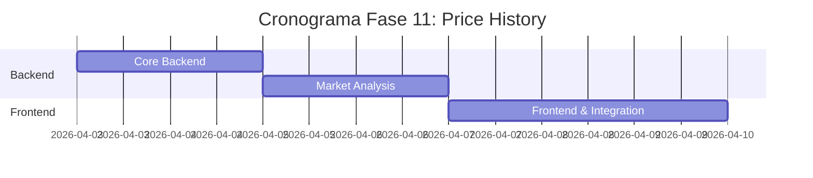

# 📈 Plan de Implementación - Fase 11: Price History (Historial de Precios)

## 📋 Información General

| Campo | Valor |
|-------|-------|
| **Nombre** | Fase 11: Price History - Historial de Precios |
| **Duración** | 1 semana |
| **Fecha Inicio** | 3 de abril, 2026 |
| **Fecha Fin** | 10 de abril, 2026 |
| **Responsable** | Equipo Desarrollo Full-Stack |
| **Prioridad** | Media |

## 🎯 Objetivos

### Objetivo Principal
Implementar un sistema completo de seguimiento y análisis de historial de precios que permita a usuarios y administradores rastrear cambios de precio, tendencias del mercado y generar insights valiosos para la toma de decisiones en InmoTech.

### Objetivos Específicos
- ✅ Desarrollar tracking automático de cambios de precio
- ✅ Crear visualizaciones gráficas de tendencias
- ✅ Implementar alertas de cambios de precio
- ✅ Generar análisis de mercado automatizado
- ✅ Integrar comparativas de propiedades similares
- ✅ Establecer predicciones básicas de precio

## 🔧 Componentes a Implementar

### Backend Components

#### 1. Controllers
- **priceHistoryController.js**
  - `getPriceHistory()` - Obtener historial de precio
  - `recordPriceChange()` - Registrar cambio de precio
  - `getMarketTrends()` - Obtener tendencias de mercado
  - `getPriceAnalytics()` - Analytics de precios
  - `getComparativeAnalysis()` - Análisis comparativo
  - `generatePriceReport()` - Generar reporte de precios

#### 2. Services
- **priceTrackingService.js**
  - `trackPriceChange()` - Rastrear cambio automático
  - `calculateTrends()` - Calcular tendencias
  - `detectAnomalies()` - Detectar anomalías en precios
  - `generateAlerts()` - Generar alertas de precio
  - `updateMarketData()` - Actualizar datos de mercado

- **marketAnalysisService.js**
  - `analyzeMarketTrends()` - Analizar tendencias del mercado
  - `calculateAverages()` - Calcular promedios por área
  - `generateInsights()` - Generar insights
  - `predictPriceMovement()` - Predicción básica de movimiento
  - `compareWithSimilar()` - Comparar con similares

#### 3. Scheduled Jobs
- **priceMonitor.js** - Monitor de cambios diarios
- **marketDataUpdater.js** - Actualizador de datos de mercado
- **trendCalculator.js** - Calculador de tendencias semanales

#### 4. Models
```javascript
// PriceHistory Model
{
  id: String,
  propertyId: String,
  previousPrice: Number,
  currentPrice: Number,
  priceChange: Number,
  percentageChange: Number,
  changeDate: Date,
  changeReason: String, // price_drop, price_increase, market_adjustment
  recordedBy: String, // system, user_id
  notes: String,
  marketConditions: {
    averageAreaPrice: Number,
    marketTrend: String,
    seasonalFactor: Number
  }
}

// MarketTrend Model
{
  id: String,
  area: String, // neighborhood, city, region
  propertyType: String,
  period: String, // daily, weekly, monthly, yearly
  averagePrice: Number,
  medianPrice: Number,
  pricePerSqm: Number,
  totalProperties: Number,
  trendDirection: String, // up, down, stable
  trendPercentage: Number,
  calculatedAt: Date,
  dataPoints: [{
    date: Date,
    price: Number,
    volume: Number
  }]
}

// PriceAlert Model
{
  id: String,
  userId: String,
  propertyId: String,
  alertType: String, // price_drop, price_increase, market_change
  threshold: Number,
  thresholdType: String, // percentage, fixed_amount
  isActive: Boolean,
  lastTriggered: Date,
  triggerCount: Number,
  createdAt: Date
}

// MarketInsight Model
{
  id: String,
  area: String,
  propertyType: String,
  insightType: String, // hot_market, price_drop_opportunity, overpriced
  confidence: Number, // 0-100
  description: String,
  affectedProperties: [String],
  validUntil: Date,
  createdAt: Date
}
```

### Frontend Components

#### 1. Charts & Visualization
- **PriceChart.js** - Gráfico principal de precio en tiempo
- **TrendChart.js** - Gráfico de tendencias de mercado
- **ComparativeChart.js** - Comparación entre propiedades
- **MarketOverview.js** - Vista general del mercado

#### 2. Analysis Components
- **PriceAnalytics.js** - Panel de analytics
- **MarketInsights.js** - Insights del mercado
- **PricePrediction.js** - Predicciones de precio
- **SimilarPropertiesComparison.js** - Comparación con similares

#### 3. Alert Components
- **PriceAlertSetup.js** - Configuración de alertas
- **PriceAlertList.js** - Lista de alertas activas
- **AlertNotification.js** - Notificaciones de alertas

#### 4. Report Components
- **PriceReport.js** - Reporte detallado de precios
- **MarketReport.js** - Reporte de mercado
- **ExportData.js** - Exportar datos a CSV/PDF

## 🚀 Actividades de Implementación

### Semana 1: Development

#### Día 1-2: Core Backend
- [ ] Crear modelos PriceHistory, MarketTrend, PriceAlert
- [ ] Implementar priceHistoryController.js
- [ ] Desarrollar priceTrackingService.js
- [ ] Configurar scheduled jobs para monitoring

#### Día 3-4: Market Analysis
- [ ] Implementar marketAnalysisService.js
- [ ] Crear algoritmos de trend calculation
- [ ] Desarrollar price prediction básica
- [ ] Configurar data aggregation jobs

#### Día 5-7: Frontend & Integration
- [ ] Crear PriceChart.js con Chart.js/D3
- [ ] Implementar PriceAnalytics.js
- [ ] Desarrollar PriceAlertSetup.js
- [ ] Integrar con propiedades existentes
- [ ] Testing completo y optimización

## 📊 API Endpoints

### Price History
```javascript
// Historical Data
GET    /api/price-history/property/:id      // Historial de una propiedad
GET    /api/price-history/area/:area        // Historial por área
POST   /api/price-history/record            // Registrar cambio manual
GET    /api/price-history/export/:id        // Exportar historial

// Market Trends
GET    /api/market/trends                   // Tendencias generales
GET    /api/market/trends/:area             // Tendencias por área
GET    /api/market/overview                 // Vista general del mercado
GET    /api/market/insights                 // Insights del mercado

// Comparative Analysis
GET    /api/price-analysis/compare          // Comparar propiedades
GET    /api/price-analysis/similar/:id      // Propiedades similares
POST   /api/price-analysis/prediction       // Predicción de precio
GET    /api/price-analysis/market-value/:id // Valor de mercado estimado
```

### Price Alerts
```javascript
// Alert Management
GET    /api/price-alerts/user              // Alertas del usuario
POST   /api/price-alerts                   // Crear alerta
PUT    /api/price-alerts/:id               // Actualizar alerta
DELETE /api/price-alerts/:id               // Eliminar alerta
POST   /api/price-alerts/:id/pause         // Pausar alerta
```

### Analytics & Reports
```javascript
// Analytics
GET    /api/analytics/price-summary        // Resumen de precios
GET    /api/analytics/market-performance   // Performance del mercado
GET    /api/analytics/price-distribution   // Distribución de precios
POST   /api/reports/price-report           // Generar reporte personalizado
```

## ✅ Criterios de Aceptación

### Funcionales
- [ ] **Tracking automático** de cambios de precio
- [ ] **Gráficos interactivos** de historial de precios
- [ ] **Alertas configurables** por porcentaje o monto fijo
- [ ] **Análisis comparativo** con propiedades similares
- [ ] **Tendencias de mercado** por área geográfica
- [ ] **Insights automáticos** sobre oportunidades
- [ ] **Reportes exportables** en PDF/CSV
- [ ] **Predicción básica** de movimiento de precios

### Técnicos
- [ ] **Performance**: Carga de gráficos en <2 segundos
- [ ] **Precisión**: 95% accuracy en tracking de cambios
- [ ] **Escalabilidad**: Procesamiento de 10,000+ propiedades
- [ ] **Real-time**: Alertas enviadas en <5 minutos
- [ ] **Data integrity**: Validación de anomalías en precios
- [ ] **Historical data**: Retención de 5+ años de datos

### UX/UI
- [ ] **Gráficos intuitivos** y responsive
- [ ] **Navegación fácil** entre períodos de tiempo
- [ ] **Colores consistentes** para trends (verde/rojo)
- [ ] **Tooltips informativos** en gráficos
- [ ] **Mobile optimization** para charts
- [ ] **Loading states** para data intensive operations

## 🧪 Plan de Pruebas

### Pruebas Unitarias
```javascript
// Backend Tests
- priceHistoryController.test.js
- priceTrackingService.test.js
- marketAnalysisService.test.js
- trend-calculation.test.js

// Frontend Tests
- PriceChart.test.js
- PriceAnalytics.test.js
- PriceAlertSetup.test.js
```

### Pruebas de Integración
- [ ] Tracking automático end-to-end
- [ ] Generación y entrega de alertas
- [ ] Cálculo de tendencias de mercado
- [ ] Exportación de reportes

### Pruebas de Performance
- [ ] Carga de charts con 1000+ data points
- [ ] Cálculo de tendencias con big datasets
- [ ] Queries optimizadas para historical data
- [ ] Responsive charts en mobile

## 📚 Documentación a Entregar

### Técnica
1. **[Arquitectura del Price Tracking](./docs/price-tracking-architecture.md)**
   - Sistema de monitoring automático
   - Algoritmos de trend calculation
   - Data model y relationships

2. **[API de Price History](./docs/price-history-api.md)**
   - Endpoints disponibles
   - Data structures
   - Query parameters

3. **[Algoritmos de Market Analysis](./docs/market-analysis-algorithms.md)**
   - Cálculo de tendencias
   - Predicción de precios
   - Detección de anomalías

### Usuario
4. **[Guía de Price Analytics](./docs/user-price-analytics-guide.md)**
   - Cómo interpretar gráficos
   - Configurar alertas de precio
   - Usar insights de mercado

5. **[Manual de Reportes](./docs/price-reports-manual.md)**
   - Generar reportes personalizados
   - Interpretar métricas
   - Exportar y compartir datos

## 🔍 Métricas de Éxito

### Métricas Técnicas
- **Data accuracy**: > 99.5% precisión en tracking
- **Chart load time**: < 2 segundos
- **Alert delivery time**: < 5 minutos
- **System uptime**: > 99.9%

### Métricas de Usuario
- **Feature adoption**: > 60% usuarios usan price history
- **Alert engagement**: > 80% alertas configuradas activas
- **Report generation**: > 100 reportes/semana
- **User satisfaction**: > 4.3/5 en usabilidad

## 🚨 Riesgos y Mitigación

### Riesgos Técnicos
| Riesgo | Impacto | Probabilidad | Mitigación |
|--------|---------|--------------|------------|
| Data inconsistency | Alto | Media | Validation rules + data cleansing |
| Performance en big datasets | Medio | Media | Indexing + query optimization |
| Chart rendering issues | Medio | Baja | Progressive loading + fallbacks |

### Riesgos de Negocio
| Riesgo | Impacto | Probabilidad | Mitigación |
|--------|---------|--------------|------------|
| False price alerts | Medio | Media | Smart thresholds + confirmation |
| Misleading market insights | Alto | Baja | Conservative algorithms + disclaimers |
| Data privacy concerns | Medio | Baja | Aggregated data only + transparency |

## 📅 Cronograma Detallado



## 📈 Chart Examples

### Price History Chart Configuration
```javascript
// Chart.js configuration for price history
{
  type: 'line',
  data: {
    datasets: [{
      label: 'Precio de la Propiedad',
      data: priceData,
      borderColor: '#4F46E5',
      backgroundColor: 'rgba(79, 70, 229, 0.1)',
      tension: 0.4
    }]
  },
  options: {
    responsive: true,
    scales: {
      y: {
        beginAtZero: false,
        ticks: {
          callback: (value) => `$${value.toLocaleString()}`
        }
      }
    },
    plugins: {
      tooltip: {
        callbacks: {
          label: (context) => `Precio: $${context.raw.y.toLocaleString()}`
        }
      }
    }
  }
}
```

---

**Última actualización**: 12 de noviembre, 2025  
**Versión**: 1.0  
**Estado**: En desarrollo