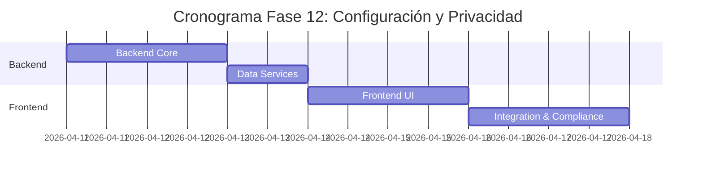

# ⚙️ Plan de Implementación - Fase 12: Configuración y Privacidad

## 📋 Información General

| Campo | Valor |
|-------|-------|
| **Nombre** | Fase 12: Configuración y Privacidad |
| **Duración** | 1 semana |
| **Fecha Inicio** | 11 de abril, 2026 |
| **Fecha Fin** | 18 de abril, 2026 |
| **Responsable** | Equipo Desarrollo Full-Stack |
| **Prioridad** | Alta (Compliance) |

## 🎯 Objetivos

### Objetivo Principal
Implementar un sistema completo de configuración de usuario y gestión de privacidad que cumpla con regulaciones GDPR, CCPA y normativas locales, proporcionando control granular sobre datos personales y preferencias de la plataforma.

### Objetivos Específicos
- ✅ Desarrollar panel de configuración de privacidad
- ✅ Implementar gestión de consentimientos
- ✅ Crear sistema de exportación de datos personales
- ✅ Establecer derecho al olvido (eliminación de datos)
- ✅ Configurar preferencias de comunicación
- ✅ Implementar configuraciones de seguridad de cuenta

## 🔧 Componentes a Implementar

### Backend Components

#### 1. Controllers
- **privacyController.js**
  - `getPrivacySettings()` - Obtener configuración de privacidad
  - `updatePrivacySettings()` - Actualizar configuración
  - `manageConsent()` - Gestionar consentimientos
  - `exportPersonalData()` - Exportar datos personales
  - `requestDataDeletion()` - Solicitar eliminación de datos
  - `getDataProcessingHistory()` - Historial de procesamiento

- **settingsController.js**
  - `getUserSettings()` - Configuraciones del usuario
  - `updateSettings()` - Actualizar configuraciones
  - `resetToDefault()` - Restablecer por defecto
  - `getAvailableSettings()` - Configuraciones disponibles
  - `validateSettings()` - Validar configuraciones

#### 2. Services
- **dataExportService.js**
  - `generateDataExport()` - Generar exportación completa
  - `collectUserData()` - Recopilar datos del usuario
  - `formatExportData()` - Formatear datos para export
  - `scheduleExport()` - Programar exportación
  - `notifyExportReady()` - Notificar export listo

- **dataDeletionService.js**
  - `processDataDeletion()` - Procesar eliminación
  - `anonymizeUserData()` - Anonimizar datos
  - `validateDeletionRequest()` - Validar solicitud
  - `scheduleRetention()` - Programar retención legal
  - `auditDataDeletion()` - Auditar eliminación

#### 3. Models
```javascript
// PrivacySettings Model
{
  userId: String,
  dataProcessing: {
    marketing: Boolean,
    analytics: Boolean,
    personalization: Boolean,
    thirdPartySharing: Boolean
  },
  communicationPreferences: {
    email: {
      marketing: Boolean,
      updates: Boolean,
      security: Boolean
    },
    sms: {
      marketing: Boolean,
      updates: Boolean,
      security: Boolean
    },
    push: {
      marketing: Boolean,
      updates: Boolean,
      security: Boolean
    }
  },
  profileVisibility: {
    public: Boolean,
    searchEngines: Boolean,
    contactInfo: Boolean,
    propertyHistory: Boolean
  },
  dataRetention: {
    deleteAfterInactivity: Number, // months
    autoDeleteMessages: Boolean,
    autoDeleteFiles: Boolean
  },
  consentHistory: [{
    type: String,
    granted: Boolean,
    timestamp: Date,
    ipAddress: String,
    userAgent: String
  }],
  lastUpdated: Date
}

// UserSettings Model
{
  userId: String,
  appearance: {
    theme: String, // light, dark, auto
    language: String,
    currency: String,
    dateFormat: String,
    timezone: String
  },
  notifications: {
    desktop: Boolean,
    email: Boolean,
    sms: Boolean,
    frequency: String // immediate, daily, weekly
  },
  search: {
    defaultLocation: Object,
    defaultFilters: Object,
    saveSearchHistory: Boolean,
    autoSuggestions: Boolean
  },
  accessibility: {
    highContrast: Boolean,
    largeText: Boolean,
    screenReader: Boolean,
    reducedMotion: Boolean
  },
  security: {
    twoFactorAuth: Boolean,
    loginNotifications: Boolean,
    sessionTimeout: Number,
    trustedDevices: [String]
  }
}

// DataExportRequest Model
{
  id: String,
  userId: String,
  requestType: String, // full, partial, specific
  status: String, // pending, processing, completed, failed
  includedData: [String],
  requestedAt: Date,
  processedAt: Date,
  expiresAt: Date,
  downloadUrl: String,
  fileSizeBytes: Number,
  notes: String
}

// DataDeletionRequest Model
{
  id: String,
  userId: String,
  requestType: String, // partial, full_account
  reason: String,
  status: String, // pending, approved, processing, completed
  requestedAt: Date,
  scheduledAt: Date,
  processedAt: Date,
  retainedData: [String], // Legal retention
  approvedBy: String,
  notes: String
}
```

### Frontend Components

#### 1. Privacy Components
- **PrivacySettingsPage.js** - Página principal de privacidad
- **ConsentManager.js** - Gestión de consentimientos
- **DataExportPanel.js** - Panel de exportación de datos
- **DataDeletionPanel.js** - Panel de eliminación de datos
- **PrivacyOverview.js** - Resumen de privacidad

#### 2. Settings Components
- **UserSettingsPage.js** - Configuraciones generales
- **NotificationSettings.js** - Configuración de notificaciones
- **SecuritySettings.js** - Configuración de seguridad
- **AccessibilitySettings.js** - Configuración de accesibilidad
- **AppearanceSettings.js** - Configuración de apariencia

#### 3. Data Management
- **DataOverview.js** - Vista general de datos
- **ConsentHistory.js** - Historial de consentimientos
- **ExportHistory.js** - Historial de exportaciones
- **AccountDeletion.js** - Eliminación de cuenta

## 🚀 Actividades de Implementación

### Semana 1: Complete Implementation

#### Día 1-2: Backend Core
- [ ] Crear modelos de PrivacySettings, UserSettings
- [ ] Implementar privacyController.js
- [ ] Desarrollar settingsController.js
- [ ] Configurar base de datos y migración

#### Día 3: Data Services
- [ ] Implementar dataExportService.js
- [ ] Crear dataDeletionService.js
- [ ] Configurar jobs de procesamiento
- [ ] Implementar audit logging

#### Día 4-5: Frontend UI
- [ ] Crear PrivacySettingsPage.js
- [ ] Implementar UserSettingsPage.js
- [ ] Desarrollar ConsentManager.js
- [ ] Crear DataExportPanel.js

#### Día 6-7: Integration & Compliance
- [ ] Integrar GDPR compliance
- [ ] Implementar cookie banner
- [ ] Testing de compliance
- [ ] Documentation y legal review

## 📊 API Endpoints

### Privacy Management
```javascript
// Privacy Settings
GET    /api/privacy/settings                // Configuración de privacidad
PUT    /api/privacy/settings                // Actualizar configuración
POST   /api/privacy/consent                 // Gestionar consentimiento
GET    /api/privacy/consent-history         // Historial de consentimientos

// Data Export
POST   /api/privacy/export-data             // Solicitar exportación
GET    /api/privacy/export-requests         // Mis solicitudes de export
GET    /api/privacy/export/:id/download     // Descargar export
DELETE /api/privacy/export/:id              // Eliminar export

// Data Deletion
POST   /api/privacy/delete-data             // Solicitar eliminación
GET    /api/privacy/deletion-requests       // Mis solicitudes de eliminación
PUT    /api/privacy/deletion/:id            // Actualizar solicitud
```

### User Settings
```javascript
// General Settings
GET    /api/settings/user                   // Configuraciones del usuario
PUT    /api/settings/user                   // Actualizar configuraciones
POST   /api/settings/reset                  // Restablecer por defecto
GET    /api/settings/available              // Configuraciones disponibles

// Specific Settings
PUT    /api/settings/appearance             // Configuración de apariencia
PUT    /api/settings/notifications          // Configuración de notificaciones
PUT    /api/settings/security               // Configuración de seguridad
PUT    /api/settings/accessibility          // Configuración de accesibilidad
```

### Admin & Compliance
```javascript
// Admin endpoints for compliance
GET    /api/admin/privacy/export-queue      // Cola de exportaciones
GET    /api/admin/privacy/deletion-queue    // Cola de eliminaciones
POST   /api/admin/privacy/approve-deletion  // Aprobar eliminación
GET    /api/admin/privacy/compliance-report // Reporte de compliance
```

## ✅ Criterios de Aceptación

### Funcionales
- [ ] **Configuración granular** de privacidad por categoría
- [ ] **Export completo** de datos en formato JSON/CSV
- [ ] **Eliminación de datos** con confirmación y audit
- [ ] **Gestión de consentimientos** con historial
- [ ] **Configuraciones personalizables** de UI/UX
- [ ] **Security settings** con 2FA y sesiones
- [ ] **Accessibility options** completas
- [ ] **Cookie banner** con opt-in/opt-out

### Compliance
- [ ] **GDPR Article 20**: Right to data portability
- [ ] **GDPR Article 17**: Right to erasure (right to be forgotten)
- [ ] **GDPR Article 7**: Consent management
- [ ] **CCPA Section 1798.100**: Right to know
- [ ] **Data minimization** principle compliance
- [ ] **Audit trail** for all privacy actions

### UX/UI
- [ ] **Interfaz clara** para configuraciones
- [ ] **Explanatory text** para cada opción
- [ ] **Confirmaciones** para acciones irreversibles
- [ ] **Progress indicators** para exports/deletions
- [ ] **Mobile optimization** para todos los settings
- [ ] **Accessibility compliance** WCAG 2.1

## 🧪 Plan de Pruebas

### Pruebas Unitarias
```javascript
// Backend Tests
- privacyController.test.js
- settingsController.test.js
- dataExportService.test.js
- dataDeletionService.test.js

// Frontend Tests
- PrivacySettingsPage.test.js
- ConsentManager.test.js
- DataExportPanel.test.js
```

### Pruebas de Compliance
- [ ] GDPR data export completeness
- [ ] Data deletion verification
- [ ] Consent withdrawal functionality
- [ ] Audit trail accuracy

### Pruebas de Seguridad
- [ ] Data access controls
- [ ] Export URL security
- [ ] Deletion confirmation security
- [ ] Session management

## 📚 Documentación a Entregar

### Legal & Compliance
1. **[Privacy Policy Implementation](./docs/privacy-policy-implementation.md)**
   - GDPR compliance measures
   - Data processing documentation
   - User rights implementation

2. **[Data Retention Policy](./docs/data-retention-policy.md)**
   - Retention periods by data type
   - Deletion procedures
   - Legal exceptions

### Técnica
3. **[Privacy API Documentation](./docs/privacy-api.md)**
   - Endpoints y funcionalidades
   - Data export formats
   - Deletion workflows

### Usuario
4. **[Privacy Settings Guide](./docs/user-privacy-guide.md)**
   - Cómo configurar privacidad
   - Exportar datos personales
   - Eliminar cuenta

5. **[Settings Customization Guide](./docs/user-settings-guide.md)**
   - Personalizar apariencia
   - Configurar notificaciones
   - Opciones de accesibilidad

## 🔍 Métricas de Éxito

### Métricas de Compliance
- **Consent rate**: > 85% opt-in for marketing
- **Export requests**: < 2% of user base annually
- **Deletion requests**: < 1% of user base annually
- **Response time**: 100% within legal timeframes

### Métricas de Adopción
- **Settings engagement**: > 70% users modify settings
- **Privacy page visits**: > 40% users visit privacy settings
- **Feature utilization**: > 60% use custom themes/language
- **Accessibility**: > 95% WCAG 2.1 compliance score

## 🚨 Riesgos y Mitigación

### Riesgos de Compliance
| Riesgo | Impacto | Probabilidad | Mitigación |
|--------|---------|--------------|------------|
| GDPR violation | Alto | Baja | Legal review + compliance testing |
| Incomplete data export | Alto | Media | Comprehensive data mapping |
| Failed data deletion | Alto | Baja | Multiple verification steps |

### Riesgos Técnicos
| Riesgo | Impacto | Probabilidad | Mitigación |
|--------|---------|--------------|------------|
| Performance en exports grandes | Medio | Media | Async processing + chunking |
| UI complexity overwhelming users | Medio | Media | User testing + progressive disclosure |
| Security vulnerabilities | Alto | Baja | Security review + penetration testing |

## 📅 Cronograma Detallado



---

**Última actualización**: 12 de noviembre, 2025  
**Versión**: 1.0  
**Estado**: En desarrollo