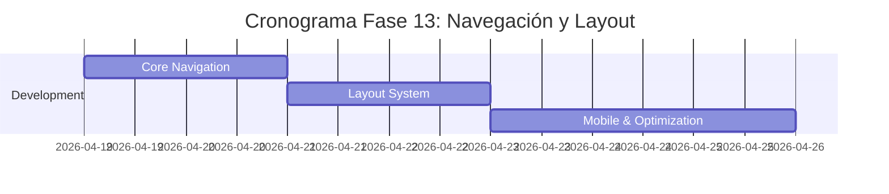

# 🧭 Plan de Implementación - Fase 13: Navegación y Layout

## 📋 Información General

| Campo | Valor |
|-------|-------|
| **Nombre** | Fase 13: Navegación y Layout |
| **Duración** | 1 semana |
| **Fecha Inicio** | 19 de abril, 2026 |
| **Fecha Fin** | 26 de abril, 2026 |
| **Responsable** | Equipo Desarrollo Frontend + UX/UI |
| **Prioridad** | Alta |

## 🎯 Objetivos

### Objetivo Principal
Implementar un sistema de navegación cohesivo y responsive que proporcione una experiencia de usuario fluida y consistente a través de toda la plataforma InmoTech, optimizando la arquitectura de información y usabilidad.

### Objetivos Específicos
- ✅ Desarrollar navegación principal adaptativa
- ✅ Implementar navegación con migas de pan inteligente
- ✅ Crear barra lateral contextual y plegable
- ✅ Establecer sistema de layout responsive
- ✅ Optimizar navegación móvil con gestures
- ✅ Integrar búsqueda global en navegación

## 🔧 Componentes a Implementar

### Frontend Components

#### 1. Núcleo de Navegación
- **Navbar.js** - Barra de navegación principal
- **Sidebar.js** - Sidebar contextual colapsable
- **MobileNav.js** - Navegación móvil con drawer
- **Breadcrumbs.js** - Navegación breadcrumb
- **SearchBar.js** - Barra de búsqueda global

#### 2. Sistema de Diseño
- **AppLayout.js** - Layout principal de aplicación
- **PageLayout.js** - Layout base para páginas
- **GridLayout.js** - Sistema de grid responsive
- **FlexLayout.js** - Componentes flexbox utilities
- **ContainerLayout.js** - Contenedores responsive

#### 3. Utilidades de Navegación
- **NavigationContext.js** - Context de navegación
- **RouteGuard.js** - Protección de rutas
- **BreadcrumbGenerator.js** - Generador automático de breadcrumbs
- **MenuGenerator.js** - Generador dinámico de menús
- **NavigationTracker.js** - Seguimiento de navegación

#### 4. Interactive Elements
- **TabNavigation.js** - Navegación por tabs
- **StepperNavigation.js** - Navegación step-by-step
- **FloatingActionButton.js** - FAB para acciones rápidas
- **QuickActions.js** - Menú de acciones rápidas
- **BackToTop.js** - Botón volver al inicio

#### 5. Mobile Specific
- **SwipeGestures.js** - Gestos de deslizado
- **PullToRefresh.js** - Pull to refresh
- **BottomNavigation.js** - Navegación inferior móvil
- **TabBar.js** - Tab bar para móviles
- **GestureNavigation.js** - Navegación por gestos

## 🚀 Actividades de Implementación

### Semana 1: Complete Navigation System

#### Día 1-2: Core Navigation
- [ ] Desarrollar Navbar.js principal responsive
- [ ] Implementar Sidebar.js contextual
- [ ] Crear MobileNav.js con drawer
- [ ] Desarrollar Breadcrumbs.js inteligente

#### Día 3-4: Layout System
- [ ] Implementar AppLayout.js base
- [ ] Crear sistema de Grid/Flex responsive
- [ ] Desarrollar PageLayout.js templates
- [ ] Configurar Container system

#### Día 5-7: Mobile & Optimization
- [ ] Implementar navegación móvil avanzada
- [ ] Crear SwipeGestures y gestos
- [ ] Optimizar performance de navigation
- [ ] Testing cross-device y responsive

## 📊 Navigation Structure

### Main Navigation Menu
```javascript
const mainMenuStructure = {
  dashboard: {
    label: 'Dashboard',
    icon: 'dashboard',
    path: '/dashboard',
    roles: ['user', 'agent', 'admin']
  },
  properties: {
    label: 'Propiedades',
    icon: 'home',
    path: '/properties',
    submenu: {
      search: { label: 'Buscar', path: '/properties/search' },
      favorites: { label: 'Favoritos', path: '/properties/favorites' },
      myProperties: { label: 'Mis Propiedades', path: '/properties/mine' }
    }
  },
  offers: {
    label: 'Ofertas',
    icon: 'offer',
    path: '/offers',
    submenu: {
      received: { label: 'Recibidas', path: '/offers/received' },
      sent: { label: 'Enviadas', path: '/offers/sent' },
      negotiation: { label: 'Negociación', path: '/offers/negotiation' }
    }
  },
  messages: {
    label: 'Mensajes',
    icon: 'message',
    path: '/messages',
    badge: 'unreadCount'
  },
  profile: {
    label: 'Perfil',
    icon: 'user',
    path: '/profile',
    submenu: {
      settings: { label: 'Configuración', path: '/profile/settings' },
      verifications: { label: 'Verificaciones', path: '/profile/verifications' },
      privacy: { label: 'Privacidad', path: '/profile/privacy' }
    }
  }
}
```

### Breadcrumb Configuration
```javascript
const breadcrumbConfig = {
  '/properties/search': ['Inicio', 'Propiedades', 'Buscar'],
  '/properties/:id': ['Inicio', 'Propiedades', '{propertyTitle}'],
  '/properties/:id/edit': ['Inicio', 'Propiedades', '{propertyTitle}', 'Editar'],
  '/offers/negotiation/:id': ['Inicio', 'Ofertas', 'Negociación', '{offerTitle}']
}
```

## ⚛️ React Component Structure

### App Layout Component
```jsx
// AppLayout.js
const AppLayout = ({ children }) => {
  const [sidebarOpen, setSidebarOpen] = useState(false);
  const [isMobile, setIsMobile] = useState(false);
  
  return (
    <div className="app-layout">
      <Navbar 
        onMenuToggle={() => setSidebarOpen(!sidebarOpen)}
        isMobile={isMobile}
      />
      <div className="main-container">
        <Sidebar 
          isOpen={sidebarOpen}
          onClose={() => setSidebarOpen(false)}
          isMobile={isMobile}
        />
        <main className="content-area">
          <Breadcrumbs />
          {children}
        </main>
      </div>
      {isMobile && (
        <BottomNavigation />
      )}
    </div>
  );
};
```

### Navigation Context
```jsx
// NavigationContext.js
const NavigationContext = createContext({
  currentPath: '',
  breadcrumbs: [],
  menuItems: [],
  updateBreadcrumbs: () => {},
  setActiveMenuItem: () => {}
});

export const NavigationProvider = ({ children }) => {
  const [navigationState, setNavigationState] = useState({
    currentPath: window.location.pathname,
    breadcrumbs: [],
    activeMenuItem: null
  });

  const updateBreadcrumbs = useCallback((path) => {
    const breadcrumbs = generateBreadcrumbs(path);
    setNavigationState(prev => ({
      ...prev,
      breadcrumbs
    }));
  }, []);

  return (
    <NavigationContext.Provider value={{
      ...navigationState,
      updateBreadcrumbs
    }}>
      {children}
    </NavigationContext.Provider>
  );
};
```

## 🎨 Responsive Design Breakpoints

```scss
// Layout breakpoints
$breakpoints: (
  xs: 320px,   // Mobile small
  sm: 576px,   // Mobile
  md: 768px,   // Tablet
  lg: 992px,   // Desktop small
  xl: 1200px,  // Desktop
  xxl: 1400px  // Desktop large
);

// Navigation responsive behavior
.navbar {
  @include media-breakpoint-down(md) {
    .navbar-nav {
      display: none;
    }
    .mobile-menu-toggle {
      display: block;
    }
  }
  
  @include media-breakpoint-up(lg) {
    .mobile-menu-toggle {
      display: none;
    }
  }
}

.sidebar {
  @include media-breakpoint-down(md) {
    position: fixed;
    transform: translateX(-100%);
    transition: transform 0.3s ease;
    
    &.open {
      transform: translateX(0);
    }
  }
}
```

## 📱 Mobile Navigation Features

### Gesture Navigation
```javascript
// SwipeGestures.js
const SwipeGestures = ({ onSwipeLeft, onSwipeRight, children }) => {
  const [startTouch, setStartTouch] = useState(null);
  
  const handleTouchStart = (e) => {
    setStartTouch({
      x: e.touches[0].clientX,
      y: e.touches[0].clientY,
      time: Date.now()
    });
  };
  
  const handleTouchEnd = (e) => {
    if (!startTouch) return;
    
    const endTouch = {
      x: e.changedTouches[0].clientX,
      y: e.changedTouches[0].clientY,
      time: Date.now()
    };
    
    const deltaX = endTouch.x - startTouch.x;
    const deltaY = endTouch.y - startTouch.y;
    const deltaTime = endTouch.time - startTouch.time;
    
    // Detect horizontal swipe
    if (Math.abs(deltaX) > Math.abs(deltaY) && 
        Math.abs(deltaX) > 50 && 
        deltaTime < 300) {
      if (deltaX > 0) {
        onSwipeRight();
      } else {
        onSwipeLeft();
      }
    }
  };
  
  return (
    <div 
      onTouchStart={handleTouchStart}
      onTouchEnd={handleTouchEnd}
    >
      {children}
    </div>
  );
};
```

## ✅ Criterios de Aceptación

### Funcionales
- [ ] **Navegación responsiva** que se adapta a todos los dispositivos
- [ ] **Breadcrumbs dinámicos** que se generan automáticamente
- [ ] **Sidebar contextual** que muestra opciones relevantes
- [ ] **Búsqueda global** accesible desde cualquier página
- [ ] **Navegación móvil** optimizada con gestos
- [ ] **Estados de navegación** claros (activo, hover, disabled)
- [ ] **Carga lazy** de menús y submenús
- [ ] **Accesibilidad completa** con navegación por teclado

### Performance
- [ ] **Tiempo de carga**: < 100ms para cambios de navegación
- [ ] **Smooth animations**: 60fps en transiciones
- [ ] **Bundle size**: < 50KB para componentes de navegación
- [ ] **Memory usage**: Optimizado para móviles de gama baja
- [ ] **Touch response**: < 100ms para interacciones táctiles

### UX/UI
- [ ] **Consistencia visual** en todos los estados
- [ ] **Feedback inmediato** para todas las interacciones
- [ ] **Orientación clara** del usuario en la aplicación
- [ ] **Acceso rápido** a funciones principales
- [ ] **Navegación intuitiva** sin curva de aprendizaje
- [ ] **Adaptabilidad** a preferencias del usuario

## 🧪 Plan de Pruebas

### Pruebas de Componentes
```javascript
// Navigation component tests
- Navbar.test.js
- Sidebar.test.js
- Breadcrumbs.test.js
- MobileNav.test.js
- SwipeGestures.test.js
```

### Pruebas de Responsividad
- [ ] Testing en múltiples dispositivos y tamaños
- [ ] Verificación de breakpoints
- [ ] Pruebas de orientación (portrait/landscape)
- [ ] Testing de gestos en dispositivos táctiles

### Pruebas de Accesibilidad
- [ ] Navegación por teclado completa
- [ ] Screen reader compatibility
- [ ] Contraste de colores adecuado
- [ ] Focus management apropiado

### Pruebas de Performance
- [ ] Bundle size optimization
- [ ] Loading time de componentes
- [ ] Memory usage monitoring
- [ ] Touch response latency

## 📚 Documentación a Entregar

### Técnica
1. **[Navigation Architecture Guide](./docs/navigation-architecture.md)**
   - Estructura de componentes
   - Estado management
   - Routing configuration

2. **[Responsive Layout System](./docs/responsive-layout-system.md)**
   - Breakpoint usage
   - Grid system
   - Component adaptation strategies

3. **[Mobile Navigation Patterns](./docs/mobile-navigation-patterns.md)**
   - Gesture implementation
   - Touch optimization
   - Performance considerations

### Usuario
4. **[Navigation User Guide](./docs/navigation-user-guide.md)**
   - Cómo usar la navegación
   - Shortcuts y atajos
   - Personalización disponible

5. **[Mobile App Navigation](./docs/mobile-app-navigation.md)**
   - Gestos disponibles
   - Navegación táctil
   - Opciones de accesibilidad

## 🔍 Métricas de Éxito

### Métricas de Usabilidad
- **Navigation efficiency**: < 3 clicks para funciones principales
- **User path completion**: > 90% completitud en flujos principales
- **Mobile navigation adoption**: > 85% usuarios usan gestos
- **Search usage**: > 40% usuarios usan búsqueda global

### Métricas Técnicas
- **Page load impact**: < 5% incremento por navegación
- **Animation smoothness**: 60fps en 95% de dispositivos
- **Accessibility score**: > 95% WCAG 2.1 compliance
- **Cross-browser compatibility**: 100% en navegadores target

## 🚨 Riesgos y Mitigación

### Riesgos de UX
| Riesgo | Impacto | Probabilidad | Mitigación |
|--------|---------|--------------|------------|
| Navegación confusa | Alto | Media | User testing + iteraciones |
| Performance en móviles | Medio | Media | Optimización específica + testing |
| Inconsistencia cross-platform | Medio | Baja | Design system estricto |

### Riesgos Técnicos
| Riesgo | Impacto | Probabilidad | Mitigación |
|--------|---------|--------------|------------|
| Bundle size inflation | Medio | Media | Tree shaking + code splitting |
| Browser compatibility | Medio | Baja | Progressive enhancement |
| Touch gesture conflicts | Medio | Media | Gesture priority system |

## 📅 Cronograma Detallado



---

**Última actualización**: 12 de noviembre, 2025  
**Versión**: 1.0  
**Estado**: En desarrollo