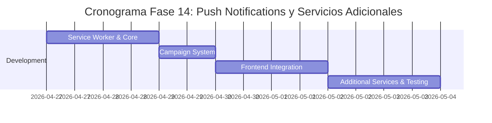

# 📲 Plan de Implementación - Fase 14: Push Notifications y Servicios Adicionales

## 📋 Información General

| Campo | Valor |
|-------|-------|
| **Nombre** | Fase 14: Push Notifications y Servicios Adicionales |
| **Duración** | 1 semana |
| **Fecha Inicio** | 27 de abril, 2026 |
| **Fecha Fin** | 4 de mayo, 2026 |
| **Responsable** | Equipo Desarrollo Full-Stack + DevOps |
| **Prioridad** | Media-Alta |

## 🎯 Objetivos

### Objetivo Principal
Implementar un sistema completo de push notifications nativo para navegadores y dispositivos móviles, junto con servicios adicionales que mejoren la experiencia del usuario y la retención en la plataforma InmoTech.

### Objetivos Específicos
- ✅ Configurar Web Push Notifications (PWA ready)
- ✅ Implementar service worker para notificaciones offline
- ✅ Desarrollar sistema de segmentación de audiencia
- ✅ Crear campañas automatizadas de push notifications
- ✅ Integrar analytics de engagement de notificaciones
- ✅ Implementar servicios adicionales (geolocalización, weather, etc.)

## 🔧 Componentes a Implementar

### Backend Components

#### 1. Push Notification Services
- **pushNotificationService.js**
  - `registerDevice()` - Registrar dispositivo
  - `sendPushNotification()` - Enviar push notification
  - `sendBulkNotifications()` - Envío masivo
  - `scheduleNotification()` - Programar notificación
  - `cancelScheduledNotification()` - Cancelar programada
  - `getDeliveryStats()` - Estadísticas de entrega

#### 2. Campaign Management
- **campaignService.js**
  - `createCampaign()` - Crear campaña
  - `scheduleCampaign()` - Programar campaña
  - `sendCampaign()` - Enviar campaña
  - `pauseCampaign()` - Pausar campaña
  - `getCampaignAnalytics()` - Analytics de campaña
  - `segmentAudience()` - Segmentar audiencia

#### 3. Additional Services
- **locationService.js**
  - `getCurrentLocation()` - Ubicación actual
  - `getNearbyProperties()` - Propiedades cercanas
  - `calculateDistance()` - Calcular distancia
  - `getAreaInfo()` - Información del área

- **weatherService.js**
  - `getCurrentWeather()` - Clima actual
  - `getWeatherForecast()` - Pronóstico
  - `getLocationWeather()` - Clima por ubicación

#### 4. Models
```javascript
// PushSubscription Model
{
  id: String,
  userId: String,
  endpoint: String,
  keys: {
    auth: String,
    p256dh: String
  },
  userAgent: String,
  isActive: Boolean,
  lastUsed: Date,
  createdAt: Date,
  deviceInfo: {
    browser: String,
    os: String,
    deviceType: String // mobile, desktop, tablet
  }
}

// PushCampaign Model
{
  id: String,
  name: String,
  description: String,
  type: String, // promotional, informational, urgent
  status: String, // draft, scheduled, sending, sent, paused
  targetAudience: {
    criteria: Object,
    estimatedReach: Number
  },
  content: {
    title: String,
    body: String,
    icon: String,
    image: String,
    badge: String,
    actions: [{
      action: String,
      title: String,
      icon: String
    }],
    data: Object
  },
  scheduling: {
    sendAt: Date,
    timezone: String,
    recurring: Boolean,
    frequency: String
  },
  analytics: {
    sent: Number,
    delivered: Number,
    clicked: Number,
    dismissed: Number,
    unsubscribed: Number
  },
  createdBy: String,
  createdAt: Date,
  sentAt: Date
}

// NotificationLog Model
{
  id: String,
  userId: String,
  campaignId: String,
  subscriptionId: String,
  status: String, // sent, delivered, clicked, failed
  sentAt: Date,
  deliveredAt: Date,
  clickedAt: Date,
  failureReason: String,
  userAgent: String
}
```

### Frontend Components

#### 1. Service Worker
- **sw.js** - Service Worker principal
- **notificationHandler.js** - Manejo de notificaciones
- **backgroundSync.js** - Sincronización en background
- **pushEventHandler.js** - Manejo de eventos push

#### 2. Push Notification Components
- **PushNotificationSetup.js** - Configuración inicial
- **NotificationPermissions.js** - Gestión de permisos
- **PushSubscriptionManager.js** - Gestión de suscripciones
- **NotificationPreview.js** - Vista previa de notificaciones

#### 3. Campaign Management (Admin)
- **CampaignDashboard.js** - Dashboard de campañas
- **CampaignBuilder.js** - Constructor de campañas
- **AudienceSegmentation.js** - Segmentación de audiencia
- **CampaignAnalytics.js** - Analytics de campañas

#### 4. Additional Services Components
- **LocationServices.js** - Servicios de ubicación
- **WeatherWidget.js** - Widget del clima
- **NearbyProperties.js** - Propiedades cercanas
- **MapIntegration.js** - Integración con mapas

## 🚀 Actividades de Implementación

### Semana 1: Complete Implementation

#### Día 1-2: Service Worker & Core
- [ ] Implementar service worker base
- [ ] Configurar Web Push API
- [ ] Desarrollar pushNotificationService.js
- [ ] Crear modelos de base de datos

#### Día 3: Campaign System
- [ ] Implementar campaignService.js
- [ ] Crear sistema de segmentación
- [ ] Desarrollar scheduler para campaigns
- [ ] Configurar analytics tracking

#### Día 4-5: Frontend Integration
- [ ] Crear PushNotificationSetup.js
- [ ] Implementar CampaignBuilder.js admin
- [ ] Desarrollar NotificationPermissions.js
- [ ] Integrar analytics dashboard

#### Día 6-7: Additional Services & Testing
- [ ] Implementar locationService.js y weatherService.js
- [ ] Crear LocationServices.js y WeatherWidget.js
- [ ] Testing completo del sistema
- [ ] Optimización y deployment

## 📊 Service Worker Implementation

### Main Service Worker
```javascript
// sw.js
self.addEventListener('push', function(event) {
  const options = {
    body: event.data ? event.data.json().body : 'Nueva notificación',
    icon: '/icons/notification-icon.png',
    badge: '/icons/badge.png',
    vibrate: [200, 100, 200],
    data: event.data ? event.data.json().data : {},
    actions: [
      {
        action: 'view',
        title: 'Ver',
        icon: '/icons/view-icon.png'
      },
      {
        action: 'dismiss',
        title: 'Descartar',
        icon: '/icons/dismiss-icon.png'
      }
    ],
    requireInteraction: true,
    tag: event.data ? event.data.json().tag : 'default'
  };

  const title = event.data ? event.data.json().title : 'InmoTech';
  
  event.waitUntil(
    self.registration.showNotification(title, options).then(() => {
      // Track notification shown
      return fetch('/api/push-notifications/track', {
        method: 'POST',
        body: JSON.stringify({
          action: 'shown',
          notificationId: options.data.id
        }),
        headers: {
          'Content-Type': 'application/json'
        }
      });
    })
  );
});

self.addEventListener('notificationclick', function(event) {
  const notification = event.notification;
  const action = event.action;
  
  if (action === 'dismiss') {
    notification.close();
    return;
  }
  
  // Track click
  event.waitUntil(
    fetch('/api/push-notifications/track', {
      method: 'POST',
      body: JSON.stringify({
        action: 'clicked',
        notificationId: notification.data.id
      }),
      headers: {
        'Content-Type': 'application/json'
      }
    }).then(() => {
      // Open specific URL based on notification data
      const urlToOpen = notification.data.url || '/dashboard';
      return clients.openWindow(urlToOpen);
    })
  );
  
  notification.close();
});
```

### Push Subscription Manager
```javascript
// PushSubscriptionManager.js
class PushSubscriptionManager {
  constructor() {
    this.applicationServerKey = process.env.REACT_APP_VAPID_PUBLIC_KEY;
  }

  async requestPermission() {
    const permission = await Notification.requestPermission();
    return permission === 'granted';
  }

  async subscribe() {
    if (!('serviceWorker' in navigator) || !('PushManager' in window)) {
      throw new Error('Push messaging is not supported');
    }

    const registration = await navigator.serviceWorker.ready;
    
    const subscription = await registration.pushManager.subscribe({
      userVisibleOnly: true,
      applicationServerKey: this.urlBase64ToUint8Array(this.applicationServerKey)
    });

    // Send subscription to server
    await this.sendSubscriptionToServer(subscription);
    return subscription;
  }

  async sendSubscriptionToServer(subscription) {
    const response = await fetch('/api/push-notifications/subscribe', {
      method: 'POST',
      headers: {
        'Content-Type': 'application/json',
        'Authorization': `Bearer ${localStorage.getItem('token')}`
      },
      body: JSON.stringify({
        subscription: subscription.toJSON(),
        userAgent: navigator.userAgent
      })
    });

    if (!response.ok) {
      throw new Error('Failed to send subscription to server');
    }
  }

  urlBase64ToUint8Array(base64String) {
    const padding = '='.repeat((4 - base64String.length % 4) % 4);
    const base64 = (base64String + padding)
      .replace(/-/g, '+')
      .replace(/_/g, '/');

    const rawData = window.atob(base64);
    const outputArray = new Uint8Array(rawData.length);

    for (let i = 0; i < rawData.length; ++i) {
      outputArray[i] = rawData.charCodeAt(i);
    }
    return outputArray;
  }
}
```

## 📊 API Endpoints

### Push Notifications
```javascript
// Device Management
POST   /api/push-notifications/subscribe      // Registrar dispositivo
DELETE /api/push-notifications/unsubscribe   // Desregistrar dispositivo
GET    /api/push-notifications/subscriptions // Mis suscripciones
PUT    /api/push-notifications/subscription/:id // Actualizar suscripción

// Sending Notifications
POST   /api/push-notifications/send          // Enviar notificación individual
POST   /api/push-notifications/send-bulk     // Envío masivo
POST   /api/push-notifications/schedule      // Programar notificación
DELETE /api/push-notifications/cancel/:id    // Cancelar programada

// Analytics
POST   /api/push-notifications/track         // Tracking de eventos
GET    /api/push-notifications/analytics     // Analytics generales
GET    /api/push-notifications/delivery-stats // Estadísticas de entrega
```

### Campaigns
```javascript
// Campaign Management
GET    /api/campaigns                        // Lista de campañas
POST   /api/campaigns                        // Crear campaña
PUT    /api/campaigns/:id                    // Actualizar campaña
DELETE /api/campaigns/:id                    // Eliminar campaña
POST   /api/campaigns/:id/send              // Enviar campaña
POST   /api/campaigns/:id/pause             // Pausar campaña

// Analytics
GET    /api/campaigns/:id/analytics         // Analytics de campaña
GET    /api/campaigns/:id/logs              // Logs de entrega
POST   /api/campaigns/test                  // Enviar campaña de prueba
```

### Additional Services
```javascript
// Location Services
POST   /api/location/current                // Ubicación actual
GET    /api/location/nearby-properties      // Propiedades cercanas
POST   /api/location/distance               // Calcular distancia
GET    /api/location/area-info/:lat/:lng    // Info del área

// Weather Services
GET    /api/weather/current/:lat/:lng       // Clima actual
GET    /api/weather/forecast/:lat/:lng      // Pronóstico
GET    /api/weather/location/:city          // Clima por ciudad
```

## ✅ Criterios de Aceptación

### Funcionales
- [ ] **Push notifications nativas** funcionando en todos los navegadores compatibles
- [ ] **Service worker** registrado y manejando eventos correctamente
- [ ] **Campaign builder** intuitivo para crear campañas
- [ ] **Segmentación de audiencia** por criterios múltiples
- [ ] **Analytics detallados** de delivery y engagement
- [ ] **Programación de campañas** con timezone support
- [ ] **Geolocalización** para propiedades cercanas
- [ ] **Widget de clima** con información relevante

### Técnicos
- [ ] **VAPID keys** configuradas correctamente
- [ ] **Delivery rate**: > 95% notificaciones entregadas
- [ ] **Performance**: < 2 segundos para envío de campaña
- [ ] **Battery optimization**: Minimal impact en dispositivos móviles
- [ ] **Offline support**: Service worker funcional sin conexión
- [ ] **Cross-browser**: Compatible con Chrome, Firefox, Safari, Edge

### UX/UI
- [ ] **Permission request** no intrusiva y con contexto
- [ ] **Notification design** consistente con brand
- [ ] **Action buttons** funcionales y útiles
- [ ] **Unsubscribe** fácil y respetado inmediatamente
- [ ] **Preview mode** para testear notificaciones
- [ ] **Analytics dashboard** claro y actionable

## 🧪 Plan de Pruebas

### Pruebas Unitarias
```javascript
// Backend Tests
- pushNotificationService.test.js
- campaignService.test.js
- locationService.test.js
- weatherService.test.js

// Frontend Tests
- PushSubscriptionManager.test.js
- CampaignBuilder.test.js
- sw.test.js (service worker testing)
```

### Pruebas de Integración
- [ ] Flujo completo de suscripción a push
- [ ] Envío y recepción de notificaciones
- [ ] Campaign creation y delivery
- [ ] Analytics tracking accuracy

### Pruebas Cross-Browser
- [ ] Chrome (desktop y mobile)
- [ ] Firefox (desktop y mobile)
- [ ] Safari (desktop y mobile)
- [ ] Edge (desktop)

### Pruebas de Performance
- [ ] Battery impact en móviles
- [ ] Memory usage del service worker
- [ ] Delivery time bajo diferentes cargas
- [ ] Offline functionality

## 📚 Documentación a Entregar

### Técnica
1. **[Push Notifications Architecture](./docs/push-notifications-architecture.md)**
   - Service worker implementation
   - VAPID configuration
   - Message queuing system

2. **[Campaign Management System](./docs/campaign-management.md)**
   - Campaign builder workflow
   - Audience segmentation
   - Analytics implementation

3. **[Additional Services Integration](./docs/additional-services.md)**
   - Location services setup
   - Weather API integration
   - Third-party service management

### Usuario
4. **[Push Notifications User Guide](./docs/user-push-notifications.md)**
   - Cómo activar notificaciones
   - Gestionar preferencias
   - Troubleshooting común

5. **[Campaign Creation Manual](./docs/admin-campaigns-manual.md)**
   - Crear campañas efectivas
   - Segmentar audiencias
   - Interpretar analytics

## 🔍 Métricas de Éxito

### Métricas de Engagement
- **Opt-in rate**: > 60% usuarios aceptan push notifications
- **Click-through rate**: > 12% promedio en campaigns
- **Unsubscribe rate**: < 3% mensual
- **Re-engagement**: > 25% usuarios inactivos reactivados

### Métricas Técnicas
- **Delivery success rate**: > 95%
- **Delivery time**: < 30 segundos promedio
- **Service worker uptime**: > 99.9%
- **Battery impact**: < 2% daily usage

## 🚨 Riesgos y Mitigación

### Riesgos de Engagement
| Riesgo | Impacto | Probabilidad | Mitigación |
|--------|---------|--------------|------------|
| Spam perception | Alto | Media | Smart frequency capping + relevancy |
| Permission denial | Medio | Alta | Contextual permission requests |
| High unsubscribe rate | Medio | Media | A/B testing + content optimization |

### Riesgos Técnicos
| Riesgo | Impacto | Probabilidad | Mitigación |
|--------|---------|--------------|------------|
| Browser compatibility issues | Medio | Media | Progressive enhancement + fallbacks |
| Service worker failures | Alto | Baja | Error handling + monitoring |
| VAPID key exposure | Alto | Baja | Secure key management |

## 📅 Cronograma Detallado



---

**Última actualización**: 12 de noviembre, 2025  
**Versión**: 1.0  
**Estado**: En desarrollo