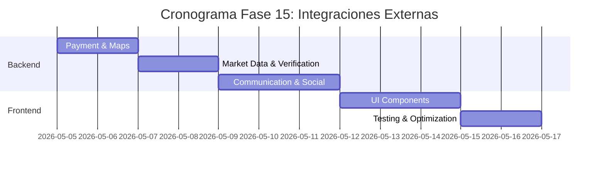

# 🔌 Plan de Implementación - Fase 15: Integraciones Externas

## 📋 Información General

| Campo | Valor |
|-------|-------|
| **Nombre** | Fase 15: Integraciones Externas |
| **Duración** | 1.5 semanas |
| **Fecha Inicio** | 5 de mayo, 2026 |
| **Fecha Fin** | 16 de mayo, 2026 |
| **Responsable** | Equipo Desarrollo Full-Stack + DevOps |
| **Prioridad** | Alta |

## 🎯 Objetivos

### Objetivo Principal
Integrar servicios externos esenciales que enriquezcan la funcionalidad de InmoTech, incluyendo mapas, pagos, análisis de mercado, verificación de identidad, y otros servicios de terceros que mejoren la experiencia del usuario.

### Objetivos Específicos
- ✅ Integrar mapas interactivos (Google Maps/Mapbox)
- ✅ Configurar gateway de pagos (Stripe/PayPal)
- ✅ Implementar análisis de mercado inmobiliario (APIs especializadas)
- ✅ Integrar servicios de verificación de identidad (KYC)
- ✅ Conectar con redes sociales para autenticación y compartir
- ✅ Implementar servicios de comunicación (Twilio SMS/Email)
- ✅ Integrar analytics y tracking (Google Analytics, Mixpanel)

## 🔧 Componentes a Implementar

### Backend Components

#### 1. Payment Integration
- **paymentService.js**
  - `processPayment()` - Procesar pago
  - `createSubscription()` - Crear suscripción
  - `handleWebhook()` - Manejar webhooks
  - `refundPayment()` - Procesar reembolso
  - `getPaymentHistory()` - Historial de pagos

#### 2. Maps & Location
- **mapsService.js**
  - `geocodeAddress()` - Geocodificar dirección
  - `reverseGeocode()` - Geocodificación inversa
  - `calculateRoute()` - Calcular ruta
  - `getNearbyPlaces()` - Lugares cercanos
  - `getPlaceDetails()` - Detalles del lugar

#### 3. External APIs
- **marketDataService.js**
  - `getMarketAnalysis()` - Análisis de mercado
  - `getComparableProperties()` - Propiedades comparables
  - `getPriceEstimate()` - Estimación de precio
  - `getMarketTrends()` - Tendencias del mercado

- **identityVerificationService.js**
  - `verifyDocument()` - Verificar documento
  - `performKYC()` - Proceso KYC completo
  - `faceMatch()` - Verificación facial
  - `getVerificationStatus()` - Estado de verificación

#### 4. Communication Services
- **communicationService.js**
  - `sendSMS()` - Enviar SMS
  - `sendEmail()` - Enviar email
  - `makeVoiceCall()` - Llamada de voz
  - `sendWhatsApp()` - Mensaje WhatsApp

#### 5. Social & Analytics
- **socialService.js**
  - `shareOnFacebook()` - Compartir en Facebook
  - `shareOnTwitter()` - Compartir en Twitter
  - `shareOnLinkedIn()` - Compartir en LinkedIn
  - `socialLogin()` - Login social

- **analyticsService.js**
  - `trackEvent()` - Tracking de eventos
  - `trackPageView()` - Tracking de páginas
  - `identifyUser()` - Identificar usuario
  - `getAnalyticsData()` - Datos de analytics

#### 6. Models
```javascript
// Integration Model
{
  id: String,
  name: String,
  provider: String,
  type: String, // payment, maps, analytics, communication
  status: String, // active, inactive, error
  credentials: {
    apiKey: String,
    secretKey: String,
    webhookUrl: String,
    sandboxMode: Boolean
  },
  configuration: Object,
  usage: {
    requests: Number,
    lastUsed: Date,
    monthlyLimit: Number,
    cost: Number
  },
  webhooks: [{
    event: String,
    url: String,
    secret: String
  }],
  createdAt: Date,
  updatedAt: Date
}

// Payment Model
{
  id: String,
  userId: String,
  amount: Number,
  currency: String,
  type: String, // subscription, listing_fee, premium_feature
  status: String, // pending, completed, failed, refunded
  provider: String, // stripe, paypal
  providerTransactionId: String,
  description: String,
  metadata: Object,
  processedAt: Date,
  refundedAt: Date,
  webhookData: Object
}

// ExternalRequest Model
{
  id: String,
  service: String,
  endpoint: String,
  method: String,
  requestData: Object,
  responseData: Object,
  status: String, // success, error, timeout
  duration: Number,
  retryCount: Number,
  userId: String,
  createdAt: Date
}
```

### Frontend Components

#### 1. Maps Integration
- **InteractiveMap.js** - Mapa interactivo principal
- **PropertyMap.js** - Mapa para mostrar propiedades
- **LocationPicker.js** - Selector de ubicación
- **RouteDisplay.js** - Mostrar rutas y direcciones
- **NearbyPlaces.js** - Lugares de interés cercanos

#### 2. Payment Components
- **PaymentForm.js** - Formulario de pago
- **SubscriptionPlans.js** - Planes de suscripción
- **PaymentHistory.js** - Historial de pagos
- **PaymentSuccess.js** - Confirmación de pago
- **RefundRequest.js** - Solicitud de reembolso

#### 3. Social Integration
- **SocialLogin.js** - Login con redes sociales
- **ShareButtons.js** - Botones de compartir
- **SocialProof.js** - Prueba social
- **SocialFeed.js** - Feed de redes sociales

#### 4. Analytics & Tracking
- **AnalyticsDashboard.js** - Dashboard de analytics
- **EventTracker.js** - Seguimiento de eventos
- **ConversionFunnel.js** - Embudo de conversión
- **UserBehaviorInsights.js** - Insights de comportamiento

#### 5. External Services UI
- **MarketAnalysisPanel.js** - Panel de análisis de mercado
- **IdentityVerification.js** - Verificación de identidad
- **CommunicationCenter.js** - Centro de comunicaciones
- **APIStatusMonitor.js** - Monitor de estado de APIs

## 🚀 Actividades de Implementación

### Semana 1: Core Integrations

#### Día 1-2: Payment & Maps
- [ ] Configurar Stripe/PayPal integration
- [ ] Implementar Google Maps/Mapbox
- [ ] Crear paymentService.js
- [ ] Desarrollar mapsService.js
- [ ] Configurar webhooks de pagos

#### Día 3-4: Market Data & Verification
- [ ] Integrar APIs de market data
- [ ] Configurar servicios de KYC/verification
- [ ] Implementar marketDataService.js
- [ ] Crear identityVerificationService.js
- [ ] Testing de APIs externas

#### Día 5-7: Communication & Social
- [ ] Configurar Twilio para SMS/Email
- [ ] Implementar social login (Google, Facebook)
- [ ] Crear communicationService.js
- [ ] Desarrollar socialService.js
- [ ] Configurar analytics tracking

### Semana 2: Frontend & Integration

#### Día 1-3: UI Components
- [ ] Crear InteractiveMap.js y PropertyMap.js
- [ ] Implementar PaymentForm.js y SubscriptionPlans.js
- [ ] Desarrollar SocialLogin.js y ShareButtons.js
- [ ] Crear AnalyticsDashboard.js

#### Día 4-5: Testing & Optimization
- [ ] Testing completo de todas las integraciones
- [ ] Optimización de performance
- [ ] Error handling y fallbacks
- [ ] Documentación de APIs

## 📊 Integration Configuration

### Payment Gateway Setup
```javascript
// Stripe Configuration
const stripe = require('stripe')(process.env.STRIPE_SECRET_KEY);

const paymentService = {
  async createPaymentIntent(amount, currency, metadata) {
    return await stripe.paymentIntents.create({
      amount: amount * 100, // Stripe expects cents
      currency: currency,
      metadata: metadata,
      automatic_payment_methods: {
        enabled: true,
      },
    });
  },

  async createSubscription(customerId, priceId) {
    return await stripe.subscriptions.create({
      customer: customerId,
      items: [{ price: priceId }],
      payment_behavior: 'default_incomplete',
      expand: ['latest_invoice.payment_intent'],
    });
  },

  async handleWebhook(payload, signature) {
    const event = stripe.webhooks.constructEvent(
      payload,
      signature,
      process.env.STRIPE_WEBHOOK_SECRET
    );

    switch (event.type) {
      case 'payment_intent.succeeded':
        await this.handlePaymentSuccess(event.data.object);
        break;
      case 'customer.subscription.created':
        await this.handleSubscriptionCreated(event.data.object);
        break;
      default:
        console.log(`Unhandled event type ${event.type}`);
    }
  }
};
```

### Maps Integration
```javascript
// Google Maps Service
class MapsService {
  constructor() {
    this.client = new GoogleMapsClient({
      key: process.env.GOOGLE_MAPS_API_KEY
    });
  }

  async geocodeAddress(address) {
    try {
      const response = await this.client.geocoding({
        address: address
      });
      
      return {
        coordinates: response.results[0].geometry.location,
        formattedAddress: response.results[0].formatted_address,
        placeId: response.results[0].place_id
      };
    } catch (error) {
      throw new Error(`Geocoding failed: ${error.message}`);
    }
  }

  async getNearbyPlaces(lat, lng, type, radius = 1000) {
    const response = await this.client.placesNearby({
      location: { lat, lng },
      radius: radius,
      type: type
    });

    return response.results.map(place => ({
      name: place.name,
      rating: place.rating,
      placeId: place.place_id,
      vicinity: place.vicinity,
      types: place.types
    }));
  }
}
```

## 📊 API Endpoints

### Payment Integration
```javascript
// Payment Processing
POST   /api/payments/intent                  // Crear payment intent
POST   /api/payments/confirm                 // Confirmar pago
GET    /api/payments/history                 // Historial de pagos
POST   /api/payments/refund                  // Procesar reembolso

// Subscriptions
POST   /api/subscriptions/create             // Crear suscripción
PUT    /api/subscriptions/:id/cancel        // Cancelar suscripción
GET    /api/subscriptions/current            // Suscripción actual
POST   /api/subscriptions/upgrade            // Upgrade plan

// Webhooks
POST   /api/webhooks/stripe                  // Webhook Stripe
POST   /api/webhooks/paypal                  // Webhook PayPal
```

### Maps & Location
```javascript
// Geocoding
POST   /api/maps/geocode                     // Geocodificar dirección
POST   /api/maps/reverse-geocode             // Geocodificación inversa
GET    /api/maps/nearby/:lat/:lng/:type      // Lugares cercanos
POST   /api/maps/route                       // Calcular ruta
GET    /api/maps/place-details/:placeId      // Detalles del lugar
```

### Market Data
```javascript
// Market Analysis
GET    /api/market/analysis/:location        // Análisis de mercado
GET    /api/market/comparables/:propertyId   // Propiedades comparables
POST   /api/market/price-estimate            // Estimación de precio
GET    /api/market/trends/:area              // Tendencias del área
```

### External Services
```javascript
// Identity Verification
POST   /api/verification/document            // Verificar documento
POST   /api/verification/kyc                 // Proceso KYC
POST   /api/verification/face-match          // Verificación facial
GET    /api/verification/status/:requestId   // Estado de verificación

// Communication
POST   /api/communication/sms                // Enviar SMS
POST   /api/communication/email              // Enviar email
POST   /api/communication/whatsapp           // Enviar WhatsApp

// Social
GET    /api/social/auth/:provider            // Auth social
POST   /api/social/share                     // Compartir contenido
GET    /api/social/profile/:provider         // Perfil social
```

## ✅ Criterios de Aceptación

### Funcionales
- [ ] **Pagos seguros** procesados correctamente con Stripe/PayPal
- [ ] **Mapas interactivos** con propiedades geolocalizadas
- [ ] **Market analysis** con datos precisos y actualizados
- [ ] **Verificación de identidad** funcional y segura
- [ ] **Social login** con Google, Facebook, LinkedIn
- [ ] **SMS/Email** notifications funcionando
- [ ] **Analytics tracking** completo y preciso
- [ ] **Compartir en redes sociales** implementado

### Técnicos
- [ ] **API rate limiting** respetado para todos los servicios
- [ ] **Error handling** robusto con fallbacks
- [ ] **Security**: Credenciales encriptadas y seguras
- [ ] **Performance**: < 2 segundos para integraciones
- [ ] **Monitoring**: Health checks para todas las APIs
- [ ] **Caching**: Respuestas cacheadas donde sea apropiado

### Compliance
- [ ] **PCI DSS**: Compliance para procesamiento de pagos
- [ ] **GDPR**: Manejo apropiado de datos de terceros
- [ ] **Terms of Service**: Cumplimiento con TOS de APIs
- [ ] **Data privacy**: Minimización de datos compartidos
- [ ] **Audit trail**: Logging completo de transacciones

## 🧪 Plan de Pruebas

### Pruebas Unitarias
```javascript
// Backend Tests
- paymentService.test.js
- mapsService.test.js
- marketDataService.test.js
- identityVerificationService.test.js
- communicationService.test.js

// Frontend Tests
- PaymentForm.test.js
- InteractiveMap.test.js
- SocialLogin.test.js
- AnalyticsDashboard.test.js
```

### Pruebas de Integración
- [ ] Flujo completo de pago con Stripe
- [ ] Geocodificación y mapas
- [ ] Social login end-to-end
- [ ] SMS/Email delivery
- [ ] Webhook processing

### Pruebas de Seguridad
- [ ] PCI compliance testing
- [ ] API key security
- [ ] Data encryption verification
- [ ] Injection attack prevention

### Pruebas de Performance
- [ ] API response times
- [ ] Map loading performance
- [ ] Payment processing speed
- [ ] Analytics data loading

## 📚 Documentación a Entregar

### Técnica
1. **[External Integrations Architecture](./docs/external-integrations-architecture.md)**
   - API integration patterns
   - Error handling strategies
   - Security implementation

2. **[Payment Gateway Integration](./docs/payment-gateway-integration.md)**
   - Stripe/PayPal setup
   - Webhook configuration
   - PCI compliance measures

3. **[Maps and Location Services](./docs/maps-location-services.md)**
   - Google Maps/Mapbox integration
   - Geocoding implementation
   - Performance optimization

### Usuario
4. **[Payment User Guide](./docs/user-payment-guide.md)**
   - Cómo realizar pagos
   - Gestionar suscripciones
   - Políticas de reembolso

5. **[External Services Manual](./docs/external-services-manual.md)**
   - Servicios disponibles
   - Limitaciones y restricciones
   - Troubleshooting

## 🔍 Métricas de Éxito

### Métricas de Integración
- **API uptime**: > 99.5% para servicios críticos
- **Response time**: < 2 segundos promedio
- **Error rate**: < 1% para todas las integraciones
- **Success rate**: > 99% para pagos

### Métricas de Negocio
- **Payment conversion**: > 90% intentos exitosos
- **Social login adoption**: > 40% usuarios
- **Map engagement**: > 80% usuarios interactúan con mapas
- **Market data usage**: > 60% usuarios consultan análisis

## 🚨 Riesgos y Mitigación

### Riesgos de Dependencias
| Riesgo | Impacto | Probabilidad | Mitigación |
|--------|---------|--------------|------------|
| API downtime de terceros | Alto | Media | Fallbacks + caching + monitoring |
| Cambios en APIs externas | Medio | Alta | Versioning + deprecation handling |
| Limits rate excedidos | Medio | Media | Rate limiting + queuing |

### Riesgos de Seguridad
| Riesgo | Impacto | Probabilidad | Mitigación |
|--------|---------|--------------|------------|
| API key exposure | Alto | Baja | Encryption + rotation + monitoring |
| Payment fraud | Alto | Media | Fraud detection + verification |
| Data breach via third party | Alto | Baja | Data minimization + encryption |

## 📅 Cronograma Detallado



---

**Última actualización**: 12 de noviembre, 2025  
**Versión**: 1.0  
**Estado**: En desarrollo