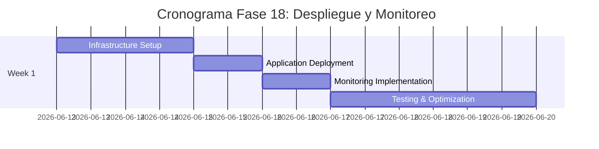

# 🚀 Plan de Implementación - Fase 18: Despliegue y Monitoreo

## 📋 Información General

| Campo | Valor |
|-------|-------|
| **Nombre** | Fase 18: Despliegue y Monitoreo |
| **Duración** | 1 semana |
| **Fecha Inicio** | 13 de junio, 2026 |
| **Fecha Fin** | 20 de junio, 2026 |
| **Responsable** | DevOps Team + Infrastructure Team |
| **Prioridad** | Crítica |

## 🎯 Objetivos

### Objetivo Principal
Implementar una infraestructura de producción robusta, escalable y monitoreada que garantice alta disponibilidad, rendimiento óptimo y observabilidad completa de la plataforma InmoTech en el entorno de producción.

### Objetivos Específicos
- ✅ Configurar infraestructura de producción en AWS/Cloud
- ✅ Implementar pipeline de deployment automatizado
- ✅ Establecer sistema de monitoreo y alertas 24/7
- ✅ Configurar logging centralizado y observabilidad
- ✅ Implementar backup y disaster recovery
- ✅ Establecer métricas de performance y SLA
- ✅ Configurar security monitoring y compliance

## 🔧 Componentes a Implementar

### Infrastructure as Code (IaC)

#### 1. Configuración de Terraform
```hcl
# main.tf - AWS Infrastructure
provider "aws" {
  region = var.aws_region
}

# VPC and Networking
module "vpc" {
  source = "terraform-aws-modules/vpc/aws"
  
  name = "inmotech-vpc"
  cidr = "10.0.0.0/16"
  
  azs             = ["${var.aws_region}a", "${var.aws_region}b", "${var.aws_region}c"]
  private_subnets = ["10.0.1.0/24", "10.0.2.0/24", "10.0.3.0/24"]
  public_subnets  = ["10.0.101.0/24", "10.0.102.0/24", "10.0.103.0/24"]
  
  enable_nat_gateway = true
  enable_vpn_gateway = true
  
  tags = {
    Environment = var.environment
    Project     = "inmotech"
  }
}

# Application Load Balancer
resource "aws_lb" "main" {
  name               = "inmotech-alb"
  internal           = false
  load_balancer_type = "application"
  security_groups    = [aws_security_group.alb.id]
  subnets           = module.vpc.public_subnets
  
  enable_deletion_protection = true
}

# ECS Cluster
resource "aws_ecs_cluster" "main" {
  name = "inmotech-cluster"
  
  capacity_providers = ["FARGATE", "FARGATE_SPOT"]
  
  setting {
    name  = "containerInsights"
    value = "enabled"
  }
}

# RDS PostgreSQL
resource "aws_db_instance" "main" {
  identifier = "inmotech-db"
  
  engine         = "postgres"
  engine_version = "13.7"
  instance_class = "db.r5.large"
  
  allocated_storage     = 100
  max_allocated_storage = 1000
  storage_encrypted     = true
  
  db_name  = var.database_name
  username = var.database_username
  password = var.database_password
  
  vpc_security_group_ids = [aws_security_group.rds.id]
  db_subnet_group_name   = aws_db_subnet_group.main.name
  
  backup_retention_period = 7
  backup_window          = "03:00-04:00"
  maintenance_window     = "sun:04:00-sun:05:00"
  
  skip_final_snapshot = false
  final_snapshot_identifier = "inmotech-db-final-snapshot"
  
  tags = {
    Environment = var.environment
  }
}

# Redis Cache
resource "aws_elasticache_replication_group" "main" {
  replication_group_id         = "inmotech-redis"
  description                  = "Redis cluster for InmoTech"
  
  node_type                    = "cache.r6g.large"
  port                         = 6379
  parameter_group_name         = "default.redis6.x"
  
  num_cache_clusters           = 2
  automatic_failover_enabled   = true
  multi_az_enabled            = true
  
  subnet_group_name = aws_elasticache_subnet_group.main.name
  security_group_ids = [aws_security_group.redis.id]
  
  at_rest_encryption_enabled = true
  transit_encryption_enabled = true
}
```

#### 2. Configuración de Docker
```dockerfile
# Backend Dockerfile
FROM node:18-alpine AS builder

WORKDIR /app
COPY package*.json ./
RUN npm ci --only=production && npm cache clean --force

FROM node:18-alpine
RUN addgroup -g 1001 -S nodejs && adduser -S nodejs -u 1001

WORKDIR /app
COPY --from=builder /app/node_modules ./node_modules
COPY . .

USER nodejs
EXPOSE 3000
HEALTHCHECK --interval=30s --timeout=3s --start-period=5s --retries=3 \
  CMD curl -f http://localhost:3000/health || exit 1

CMD ["npm", "start"]
```

```dockerfile
# Frontend Dockerfile
FROM node:18-alpine AS builder

WORKDIR /app
COPY package*.json ./
RUN npm ci
COPY . .
RUN npm run build

FROM nginx:alpine
COPY --from=builder /app/build /usr/share/nginx/html
COPY nginx.conf /etc/nginx/nginx.conf

EXPOSE 80
CMD ["nginx", "-g", "daemon off;"]
```

#### 3. Configuración de Kubernetes (Alternativa)
```yaml
# k8s-deployment.yaml
apiVersion: apps/v1
kind: Deployment
metadata:
  name: inmotech-backend
spec:
  replicas: 3
  selector:
    matchLabels:
      app: inmotech-backend
  template:
    metadata:
      labels:
        app: inmotech-backend
    spec:
      containers:
      - name: backend
        image: inmotech/backend:latest
        ports:
        - containerPort: 3000
        env:
        - name: DATABASE_URL
          valueFrom:
            secretKeyRef:
              name: inmotech-secrets
              key: database-url
        resources:
          requests:
            memory: "256Mi"
            cpu: "250m"
          limits:
            memory: "512Mi"
            cpu: "500m"
        livenessProbe:
          httpGet:
            path: /health
            port: 3000
          initialDelaySeconds: 30
          periodSeconds: 30
        readinessProbe:
          httpGet:
            path: /ready
            port: 3000
          initialDelaySeconds: 5
          periodSeconds: 5
---
apiVersion: v1
kind: Service
metadata:
  name: inmotech-backend-service
spec:
  selector:
    app: inmotech-backend
  ports:
  - protocol: TCP
    port: 80
    targetPort: 3000
  type: ClusterIP
```

### Monitoreo y Observabilidad

#### 1. Configuración de Prometheus
```yaml
# prometheus.yml
global:
  scrape_interval: 15s
  evaluation_interval: 15s

rule_files:
  - "inmotech-alerts.yml"

scrape_configs:
  - job_name: 'inmotech-backend'
    static_configs:
      - targets: ['backend:3000']
    metrics_path: /metrics
    scrape_interval: 30s

  - job_name: 'inmotech-frontend'
    static_configs:
      - targets: ['frontend:80']
    metrics_path: /metrics
    
  - job_name: 'postgres-exporter'
    static_configs:
      - targets: ['postgres-exporter:9187']
      
  - job_name: 'redis-exporter'
    static_configs:
      - targets: ['redis-exporter:9121']

alerting:
  alertmanagers:
    - static_configs:
        - targets:
          - alertmanager:9093
```

#### 2. Dashboards de Grafana
```json
{
  "dashboard": {
    "title": "InmoTech Production Monitoring",
    "panels": [
      {
        "title": "Tiempo de Respuesta de API",
        "type": "graph",
        "targets": [
          {
            "expr": "avg(http_request_duration_seconds) by (endpoint)",
            "legendFormat": "{{endpoint}}"
          }
        ]
      },
      {
        "title": "Database Connections",
        "type": "stat",
        "targets": [
          {
            "expr": "pg_stat_database_numbackends{datname=\"inmotech\"}"
          }
        ]
      },
      {
        "title": "Tasa de Errores",
        "type": "stat",
        "targets": [
          {
            "expr": "rate(http_requests_total{status=~\"5..\"}[5m]) * 100"
          }
        ]
      }
    ]
  }
}
```

#### 3. Alerting Rules
```yaml
# inmotech-alerts.yml
groups:
- name: inmotech-alerts
  rules:
  - alert: HighErrorRate
    expr: rate(http_requests_total{status=~"5.."}[5m]) * 100 > 5
    for: 5m
    labels:
      severity: critical
    annotations:
      summary: "High error rate detected"
      description: "Error rate is {{ $value }}% for the last 5 minutes"

  - alert: DatabaseDown
    expr: up{job="postgres-exporter"} == 0
    for: 1m
    labels:
      severity: critical
    annotations:
      summary: "Database is down"
      description: "PostgreSQL database has been down for more than 1 minute"

  - alert: HighMemoryUsage
    expr: (node_memory_MemTotal_bytes - node_memory_MemAvailable_bytes) / node_memory_MemTotal_bytes * 100 > 80
    for: 10m
    labels:
      severity: warning
    annotations:
      summary: "High memory usage"
      description: "Memory usage is above 80% for the last 10 minutes"

  - alert: DiskSpaceRunningOut
    expr: (node_filesystem_size_bytes - node_filesystem_free_bytes) / node_filesystem_size_bytes * 100 > 85
    for: 5m
    labels:
      severity: warning
    annotations:
      summary: "Disk space running out"
      description: "Disk usage is above 85%"
```

### Scripts de Despliegue

#### 1. Script de Despliegue Azul-Verde
```bash
#!/bin/bash
# deploy.sh - Blue-Green Deployment

set -e

ENVIRONMENT=${1:-staging}
VERSION=${2:-latest}
REGION=${AWS_REGION:-us-east-1}

echo "Starting Blue-Green deployment for $ENVIRONMENT with version $VERSION"

# Get current active environment
CURRENT=$(aws elbv2 describe-target-groups --region $REGION --query "TargetGroups[?contains(TargetGroupName, 'inmotech-$ENVIRONMENT')].TargetGroupName" --output text)

if [[ $CURRENT == *"blue"* ]]; then
    ACTIVE="blue"
    INACTIVE="green"
else
    ACTIVE="green"
    INACTIVE="blue"
fi

echo "Current active environment: $ACTIVE"
echo "Deploying to inactive environment: $INACTIVE"

# Deploy to inactive environment
echo "Updating ECS service inmotech-$ENVIRONMENT-$INACTIVE"
aws ecs update-service \
    --region $REGION \
    --cluster inmotech-cluster-$ENVIRONMENT \
    --service inmotech-$ENVIRONMENT-$INACTIVE \
    --task-definition inmotech-$ENVIRONMENT:$VERSION

# Wait for deployment to complete
echo "Waiting for deployment to complete..."
aws ecs wait services-stable \
    --region $REGION \
    --cluster inmotech-cluster-$ENVIRONMENT \
    --services inmotech-$ENVIRONMENT-$INACTIVE

# Health check
echo "Performing health check..."
HEALTH_CHECK_URL="https://$INACTIVE-$ENVIRONMENT.inmotech.com/health"
for i in {1..10}; do
    if curl -f $HEALTH_CHECK_URL; then
        echo "Health check passed"
        break
    else
        echo "Health check failed, attempt $i/10"
        sleep 30
    fi
done

# Switch load balancer target
echo "Switching load balancer to $INACTIVE environment"
aws elbv2 modify-listener \
    --region $REGION \
    --listener-arn $LISTENER_ARN \
    --default-actions Type=forward,TargetGroupArn=$INACTIVE_TARGET_GROUP_ARN

echo "Deployment completed successfully!"
echo "New active environment: $INACTIVE"
```

#### 2. Rollback Script
```bash
#!/bin/bash
# rollback.sh - Quick rollback

set -e

ENVIRONMENT=${1:-production}
REGION=${AWS_REGION:-us-east-1}

echo "Starting rollback for $ENVIRONMENT"

# Get current listener configuration
CURRENT_TARGET=$(aws elbv2 describe-listeners --region $REGION --listener-arns $LISTENER_ARN --query "Listeners[0].DefaultActions[0].TargetGroupArn" --output text)

# Determine rollback target
if [[ $CURRENT_TARGET == *"blue"* ]]; then
    ROLLBACK_TARGET=$GREEN_TARGET_GROUP_ARN
    echo "Rolling back from blue to green"
else
    ROLLBACK_TARGET=$BLUE_TARGET_GROUP_ARN
    echo "Rolling back from green to blue"
fi

# Switch load balancer
aws elbv2 modify-listener \
    --region $REGION \
    --listener-arn $LISTENER_ARN \
    --default-actions Type=forward,TargetGroupArn=$ROLLBACK_TARGET

echo "Rollback completed successfully!"
```

## 🚀 Actividades de Implementación

### Semana 1: Configuración Completa de Producción

#### Día 1-2: Configuración de Infraestructura
- [ ] Deploy AWS infrastructure using Terraform
- [ ] Configure VPC, subnets, security groups
- [ ] Setup RDS PostgreSQL y Redis cluster
- [ ] Configure Application Load Balancer

#### Día 3: Despliegue de Aplicación
- [ ] Build y push Docker images to ECR
- [ ] Deploy application to ECS/Kubernetes
- [ ] Configure environment variables y secrets
- [ ] Setup SSL certificates y domain routing

#### Día 4: Monitoring Implementation
- [ ] Deploy Prometheus y Grafana
- [ ] Configure alerting rules y notifications
- [ ] Setup log aggregation (ELK stack/CloudWatch)
- [ ] Implement application performance monitoring

#### Día 5-7: Testing & Optimization
- [ ] Perform load testing en production environment
- [ ] Configure auto-scaling policies
- [ ] Test disaster recovery procedures
- [ ] Optimize performance y security settings

## 📊 Monitoring Stack

### Métricas Principales a Rastrear
```javascript
// Application Metrics
const metrics = {
  performance: {
    responseTime: 'avg_response_time_ms',
    throughput: 'requests_per_second',
    errorRate: 'error_rate_percentage',
    uptime: 'service_uptime_percentage'
  },
  business: {
    activeUsers: 'daily_active_users',
    propertyViews: 'property_views_per_day',
    newRegistrations: 'new_registrations_per_day',
    offerSubmissions: 'offers_submitted_per_day'
  },
  infrastructure: {
    cpuUsage: 'cpu_utilization_percentage',
    memoryUsage: 'memory_utilization_percentage',
    diskSpace: 'disk_usage_percentage',
    networkIO: 'network_io_bytes_per_second'
  },
  database: {
    connections: 'active_database_connections',
    queryTime: 'avg_query_execution_time',
    deadlocks: 'database_deadlocks_per_hour',
    cacheHitRate: 'redis_cache_hit_rate'
  }
};
```

### SLA Targets
```yaml
# SLA Definitions
sla_targets:
  availability:
    target: 99.9%
    measurement_window: 30_days
    
  performance:
    api_response_time:
      target: 200ms
      percentile: 95
    
    page_load_time:
      target: 2s
      percentile: 90
      
  reliability:
    error_rate:
      target: 0.1%
      measurement_window: 24_hours
      
    recovery_time:
      target: 15_minutes
      incident_severity: high
```

### Configuración de Alertas
```yaml
# PagerDuty Integration
alertmanager:
  global:
    pagerduty_url: 'https://events.pagerduty.com/v2/enqueue'
    
  route:
    group_by: ['alertname']
    group_wait: 10s
    group_interval: 10s
    repeat_interval: 1h
    receiver: 'web.hook'
    
  receivers:
  - name: 'web.hook'
    pagerduty_configs:
    - service_key: 'your-service-key'
      description: '{{ range .Alerts }}{{ .Annotations.description }}{{ end }}'
      severity: '{{ .GroupLabels.severity }}'
```

## ✅ Criterios de Aceptación

### Infrastructure
- [ ] **High Availability**: Multi-AZ deployment funcionando
- [ ] **Auto Scaling**: Scaling automático basado en métricas
- [ ] **Load Balancing**: Traffic distribuido eficientemente
- [ ] **SSL/TLS**: HTTPS configurado con certificados válidos
- [ ] **Security Groups**: Network access controls configurados
- [ ] **Backup Strategy**: Backups automáticos configurados

### Performance
- [ ] **Response Time**: API responses < 200ms (95th percentile)
- [ ] **Page Load**: Frontend load time < 2 segundos
- [ ] **Throughput**: 1000+ concurrent users soportados
- [ ] **Uptime**: 99.9% availability achieved
- [ ] **Error Rate**: < 0.1% error rate mantenido
- [ ] **Recovery Time**: < 15 minutos para critical incidents

### Monitoring
- [ ] **24/7 Monitoring**: Alertas funcionando correctamente
- [ ] **Dashboard**: Grafana dashboards operacionales
- [ ] **Log Aggregation**: Centralized logging implementado
- [ ] **Alerting**: PagerDuty integration funcionando
- [ ] **Health Checks**: Automated health monitoring
- [ ] **Performance Tracking**: APM tools configurados

### Security
- [ ] **WAF**: Web Application Firewall configurado
- [ ] **DDoS Protection**: CloudFlare/AWS Shield activo
- [ ] **Vulnerability Scanning**: Automated security scans
- [ ] **Access Controls**: IAM roles y policies configurados
- [ ] **Encryption**: Data encryption at rest y in transit
- [ ] **Compliance**: SOC2/PCI compliance measures

## 📚 Documentación a Entregar

### Operations Documentation
1. **[Production Infrastructure Guide](./docs/production-infrastructure.md)**
   - AWS architecture overview
   - Deployment procedures
   - Scaling guidelines

2. **[Monitoring and Alerting Guide](./docs/monitoring-alerting.md)**
   - Dashboard explanations
   - Alert response procedures
   - Troubleshooting guides

3. **[Incident Response Playbook](./docs/incident-response.md)**
   - Escalation procedures
   - Recovery workflows
   - Post-mortem templates

### Runbooks
4. **[Daily Operations Runbook](./docs/daily-operations.md)**
   - Daily health checks
   - Routine maintenance tasks
   - Performance optimization

5. **[Disaster Recovery Plan](./docs/disaster-recovery.md)**
   - Backup procedures
   - Recovery scenarios
   - Business continuity plan

## 🔍 Métricas de Éxito

### Métricas Operacionales
- **Tasa de Éxito de Despliegue**: > 99% despliegues exitosos
- **MTTR (Mean Time to Recovery)**: < 15 minutes
- **MTBF (Mean Time Between Failures)**: > 30 days
- **Tasa de Éxito de Cambios**: > 95% cambios sin incidencias

### Métricas de Rendimiento
- **Availability**: 99.9% uptime (8.76 hours downtime/year max)
- **Response Time**: 95th percentile < 200ms
- **Tasa de Errores**: < 0.1% (99.9% tasa de éxito)
- **Throughput**: 10,000+ requests/minute sustained

### Métricas de Negocio
- **User Satisfaction**: > 4.5/5 performance rating
- **Revenue Impact**: < 0.1% revenue loss due to downtime
- **Cost Optimization**: Infrastructure costs < 15% of revenue
- **Incidencias de Seguridad**: 0 brechas de seguridad exitosas

## 🚨 Riesgos y Mitigación

### Riesgos de Infraestructura
| Riesgo | Impacto | Probabilidad | Mitigación |
|--------|---------|--------------|------------|
| AWS Region outage | Alto | Muy Baja | Multi-region deployment + DR plan |
| Database corruption | Alto | Baja | Automated backups + replication |
| DDoS attack | Medio | Media | CloudFlare protection + rate limiting |

### Riesgos Operacionales
| Riesgo | Impacto | Probabilidad | Mitigación |
|--------|---------|--------------|------------|
| Failed deployment | Alto | Baja | Blue-green deployment + rollback |
| Configuration drift | Medio | Media | Infrastructure as Code + monitoring |
| Human error | Alto | Media | Automation + code review + training |

### Riesgos de Seguridad
| Riesgo | Impacto | Probabilidad | Mitigación |
|--------|---------|--------------|------------|
| Data breach | Alto | Baja | Encryption + access controls + monitoring |
| Insider threat | Medio | Baja | Principle of least privilege + audit logs |
| Compliance violation | Alto | Baja | Regular audits + automated compliance checks |

## 📅 Cronograma Detallado



---

**🎉 PROYECTO COMPLETADO 🎉**

**Última actualización**: 12 de noviembre, 2025  
**Versión**: 1.0  
**Estado**: ¡LISTO PARA PRODUCCIÓN!